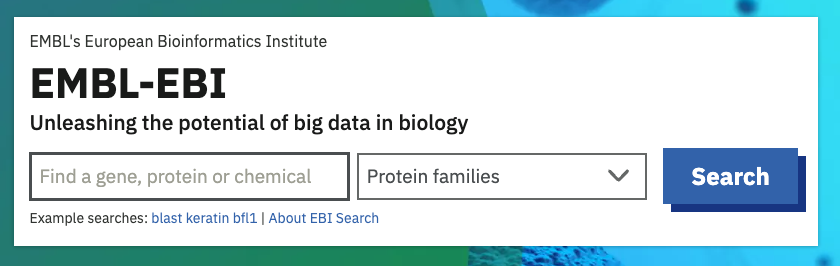
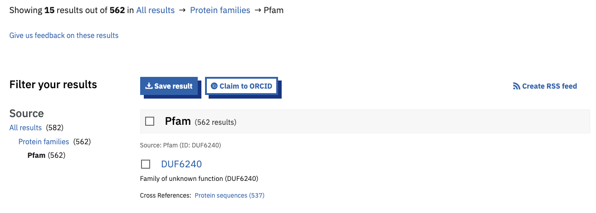

**********
Authorship
**********

We greatly appreciate the contribution made to Pfam from our user community. To acknowledge these contributions, and allow them to be an 
integral part of researchers' profiles, we have in corporated `ORCID <https://orcid.org/>`_ identifiers, displaying these in the 
'curation and model' tab of each Pfam entry.

To claim Pfam entries against your ORCID, first go to the `EMBL-EBI website <https://www.ebi.ac.uk/>`_ and search by putting your ORCID 
into the search box and selecting 'Protein Families' from the drop down.

From the results page, select **Pfam** on the left-hand side and you should then see a link at the top of the results inviting you to 
**Claim to ORCID**. Select all the entries you want to add to your ORCID and click on the button. A pop-up window will appear, inviting 
you to authenticate in the ORCID website. Once you are logged-in, click on the **Claim** button.

