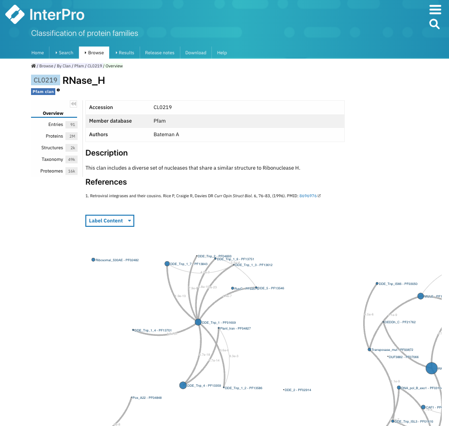
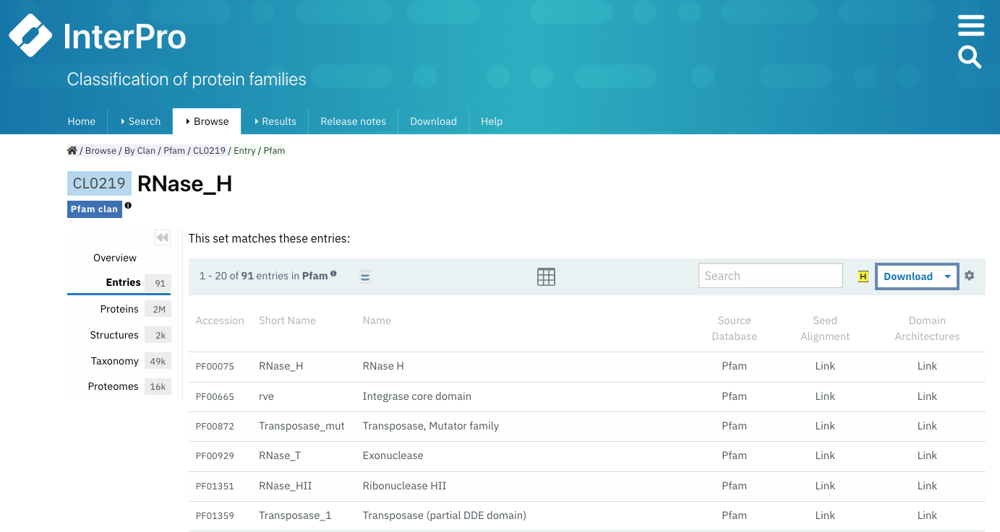
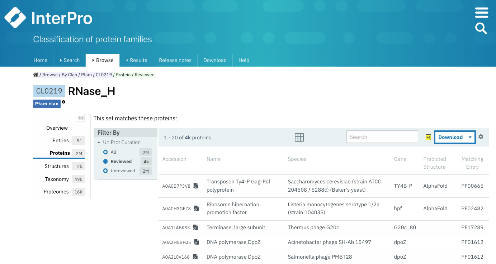
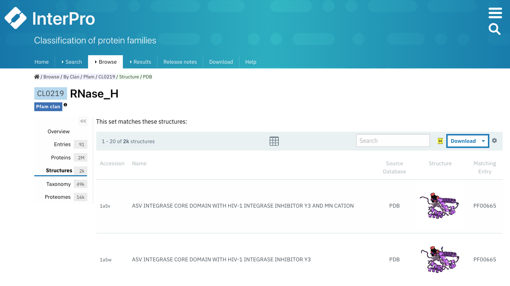
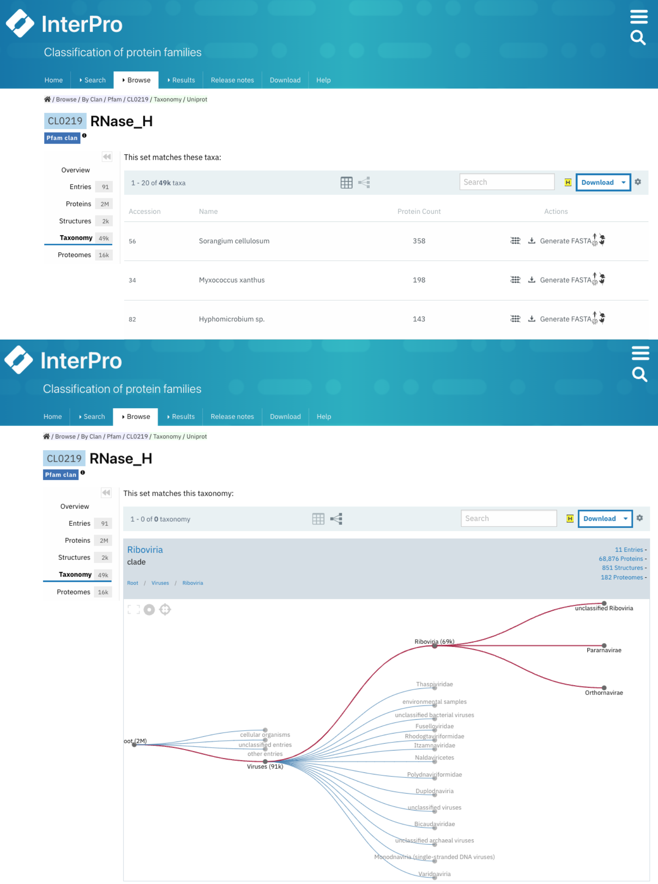
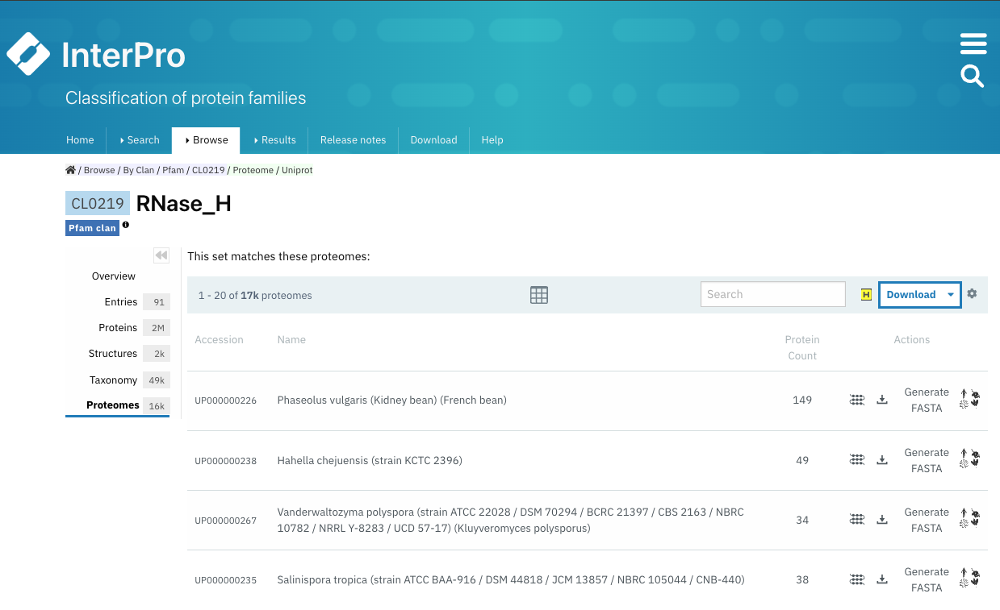

**********************
Clan page organisation
**********************

.. _CL0219: https://www.ebi.ac.uk/interpro/set/pfam/CL0219/

If a Pfam entry is included in a **Pfam clan** this information will be displayed in the **Overview** tab in the Pfam entry page, next to *Clan*, 
below the Pfam short name, with a link to the corresponding clan page. More information about how clans are defined can be found 
in :doc:`Summary 
`. 

Additionally, it is possible to browse through the Pfam clans by selecting `Browse + By Clan/Set <https://www.ebi.ac.uk/interpro/set/all/entry/pfam/#table>`_ 
in the InterPro website menu and select **Pfam** in the database section.

    Example of a Pfam clan page (CL0219_). All the tabs described below can be
    found on the left-hand side menu. The **Overview** tab is displayed by default.

In each Pfam clan page, different tabs with relevant information are available, the information they contain is described below.

Overview
========

The clan **Overview** tab is the default display, where the clan accession number, its short name and the author(s) are shown at the top. A 
description of the clan is displayed below, with the relevant literature references. 

When a Wikipedia article is available for the clan, the first paragraph of the article together with the link to the Wikipedia article are shown in the **Wikipedia** section.

An interactive view of the Pfam entries included in the clan is also displayed, different label types can be chosen through the 
**Label Content** menu: Accession, Name and Short name.

Entries
=======

The list of Pfam entries included in the clan is provided in this tab. For each entry, accession, name, short name and links to the 
entries SEED alignment and domain architectures pages are available. 

Users can export this data in different formats, by clicking on the **Download** button, and customise the page settings, by clicking on the wheel icon.

    Example of a Pfam clan page (CL0219_) with the **Entries** tab selected.

Proteins
========

The list of proteins matching any Pfam entry belonging to the clan is displayed in this tab. The view can be customised to show:

1. **All** proteins (from the whole UniProtKB database).
2. Only **Reviewed** proteins (from SwissProt - manually curated).
3. Only **Unreviewed** proteins (from TrEMBL - derived from public databases automatically integrated into UniProt).

For each protein, the corresponding protein page in InterPro can be accessed by clicking on the protein accession or name, and the 
InterPro taxonomy page can be accessed by clicking on the species name. 

Users can export this data in different formats, by clicking on the **Download** button, and customise the page settings, by clicking on the wheel icon.

    Example of a Pfam clan page (CL0219_) with the **Proteins** tab selected. The 
    table is customised to show only **Reviewed** proteins.

.. _clstruct:

Structures
==========

This tab displays a list of all the PDB structures linked to the proteins matching any Pfam entry belonging to the clan. For 
each structure, you can see the PDB accession and the name of the structure in PDB.

By clicking on a PDB accession, name or small image of the structure, you are redirected to the structure page. On this page
a summary of all the entries of Pfam and other databases and resources for each PDB chain of the structure is displayed in a 
protein sequence viewer.

The position of each entry within the overall 3D structure can be visualised by choosing the Pfam entry of interest in the drop-down list 
**Highlight Entry in the 3D structure** or by hovering/clicking on the bar corresponding to the entry match in the protein sequence viewer. 
Additionally, links to structural databases and tools are provided in the **External links** section.

    Example of a Pfam clan page (CL0219_) with the **Structures** tab selected.

Taxonomy
========

This tab shows by default a list of all the species that the proteins matched by any Pfam entry of the clan belong to.

These data can also be seen as a tree. These visualisation options can be chosen from the icon panel above the list. All this information 
can be downloaded in different formats.

    Example of a Pfam clan page (CL0219_) with the **Taxonomy** tab selected. 
    The default table listing the species having proteins belonging to this Pfam clan is displayed at the top and an example view of a 
    taxonomic tree for this clan is shown at the bottom.

Proteomes
=========

A list of the reference proteomes matched by any Pfam entry belonging to the clan is displayed in this tab. For each item in this list 
the Proteome ID (which is a link to the Proteome page), the name of the species belonging to this proteome and the number
of proteins in this proteome that match the entry are displayed. From the **Actions** column, users can also access a list of these proteins by clicking the 
first icon (**View matching proteins**), download the data in different formats or **View proteome information**.

    Example of a Pfam clan page (CL0219_) with the tab **Proteomes** selected.
