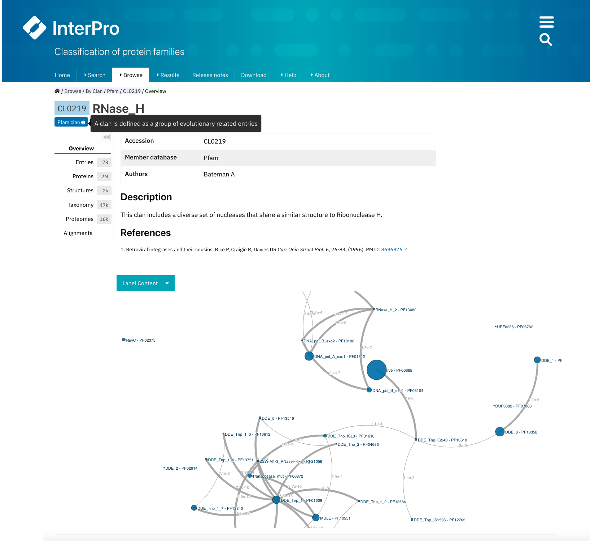
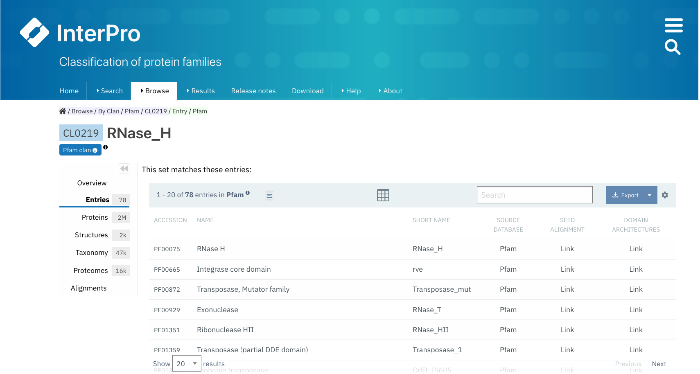
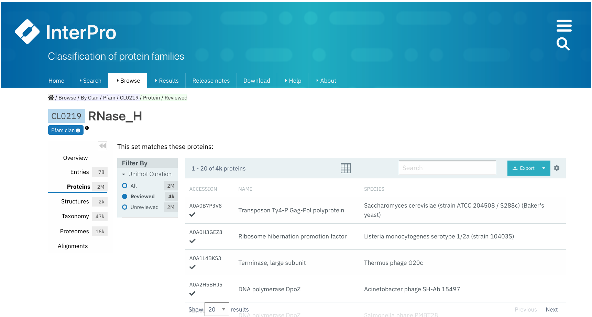
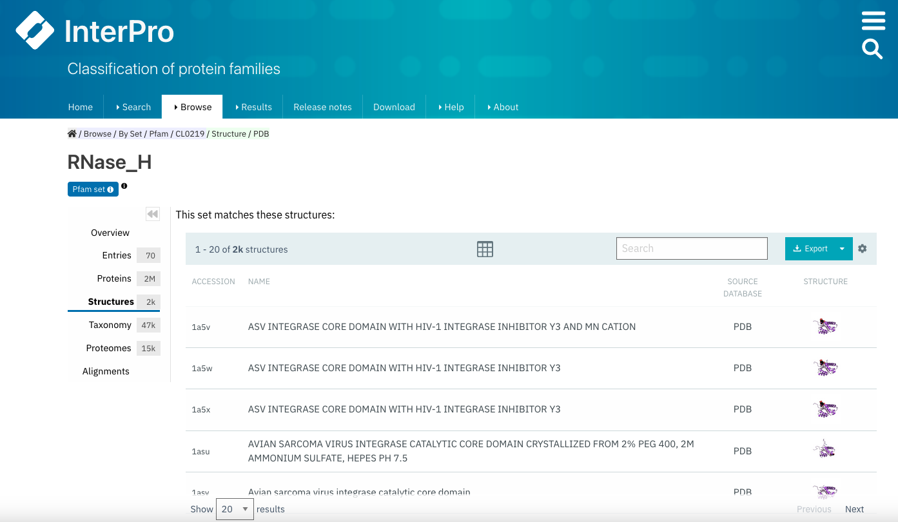
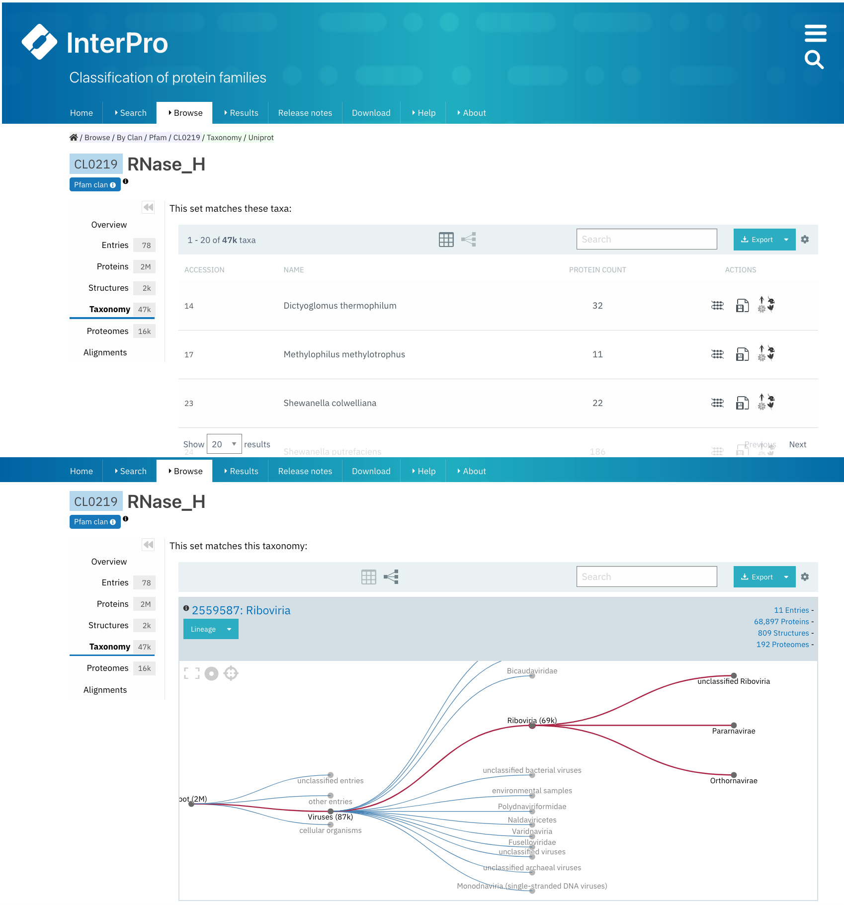
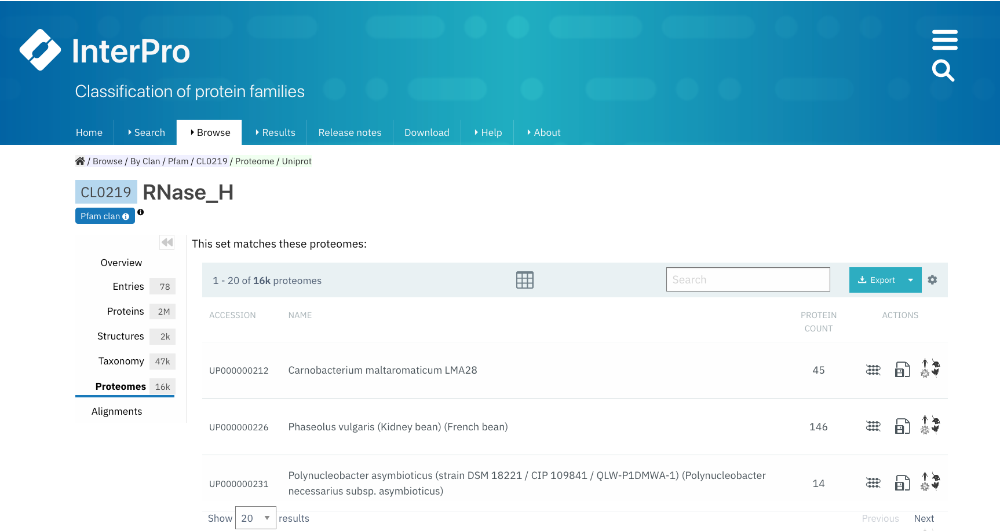

.. _clan_set-page-organisation:

**************************
Clan/Set page organisation
**************************

**Pfam clans** are called **Sets** in the InterPro website. If a Pfam entry is included in a clan this information will be displayed in the **Overview** tab, next to Set, below the Pfam short name, with a link to the corresponding clan/set page. Additionally, it is possible to browse through the Pfam clans by selecting **Browse + By Set** in the `InterPro website menu <https://www.ebi.ac.uk/interpro/set/all/entry/pfam/#table>`_ and select **Pfam** in the database section.

In each Pfam clan/set page, different tabs with relevant information are available:

    Example of a Pfam clan/set page `CL0219 <https://www.ebi.ac.uk/interpro/set/pfam/CL0219/>`_ . All the tabs explained below can be found on the left-hand menu. The tab **Overview** is displayed by default.

**Overview**
--------------
The clan/set overview tab is the default display, where clan accession number, the short name and the author(s) are shown on top. A description of the entry is displayed below, 
with the relevant literature references and an interactive view of the signatures included in the set are displayed below. For the interactive view, different label types can be chosen through the **Label Content** menu: Accession, Name and Short name.

**Entries**
-----------
The list of Pfam entries included in the clan/set is provided in this tab. For each entry, accession, name, short name and links to the entries SEED alignment and domain architectures pages are displayed. Users can export this data in different formats, by clicking on the **Export** button, and customise the page settings, by clicking on the wheel icon.

    Example of a Pfam clan/set page `CL0219 <https://www.ebi.ac.uk/interpro/set/pfam/CL0219/>`_ with the **Entries** tab selected.

**Proteins**
--------------
The list of proteins matching any Pfam entry belonging to the clan/set is displayed in this tab. The view can be customised to show:

1. **All** proteins (from the whole UniProtKB database).

2. Only '**Reviewed**' proteins (from SwissProt - manually curated).

3. Only '**Unreviewed**' proteins (from TrEMBL - derived from public databases automatically integrated into UniProt).

For each protein, the corresponding protein page in InterPro can be accessed by clicking on the protein accession or name, and the InterPro taxonomy page can be accessed by clicking on the species name. You can also export this data in different formats, by clicking on the **Export** button, and customise the page settings, by clicking on the wheel icon.

    Example of a Pfam clan/set page `CL0219 <https://www.ebi.ac.uk/interpro/set/pfam/CL0219/>`_ with the tab **Proteins** selected. The table is customised to show only **Reviewed** proteins.

**Structures**
----------------
This tab displays a list of all the PDB structures determined for the proteins matching any Pfam entry belonging to the clan/set. For each structure, you can see the PDB accession and the name of the structure in PDB.

By clicking on a PDB accession, name or small image of the structure, a view of the corresponding InterPro structure page that summarises all of the entries of Pfam and other databases and resources for each chain of the structure will be displayed in a protein sequence viewer. The position of each entry within the overall 3D structure can be visualised by choosing the Pfam entry of interest in the drop-down list **Highlight Entry in the 3D structure** or by clicking on the bar corresponding to the entry match in the protein sequence viewer. Additionally, links to similar PDB viewers and cross-references to other structural databases are provided in the **External links** section.

    Example of a Pfam clan/set page `CL0219 <https://www.ebi.ac.uk/interpro/set/pfam/CL0219/>`_ with the tab **Structures** selected.

* **Taxonomy**
--------------
This tab shows by default a list of all the species that the proteins matched by any Pfam entry of the clan/set belong to.

These data can also be seen as a tree. These visualisation options can be chosen from the icon panel above the list. All this information can be downloaded in different formats.

    Example of a Pfam clan/set page `CL0219 <https://www.ebi.ac.uk/interpro/set/pfam/CL0219/>`_ page with the tab **Taxonomy** selected. The default table listing the species habouring proteins beloging to this Pfam clan-set is displayed on top and an example view of a taxonomic tree for this clan is shown below.

**Proteomes**
---------------
A list of the reference proteomes matched by any Pfam entry belonging to the clan/set is displayed in this tab. Each item in this list shows the Proteome ID (which is a link to the Proteome page in InterPro), the name of the species carrying this proteome and the number of proteins in this proteome that match the entry. Users can also see a list of these proteins by clicking the first **Actions** (**View matching proteins**) icon, select **View proteome information** or download the data in different formats.

    Example of a Pfam clan/set page `CL0219 <https://www.ebi.ac.uk/interpro/set/pfam/CL0219/>`_ with the tab **Proteomes** selected.

**Alignment**
---------------
.. 
    Note: I don't really understand this tab. In the example I'm using there are 40 entries (but it says 40 sets?) in this list but there are 70 entries in the clan.

