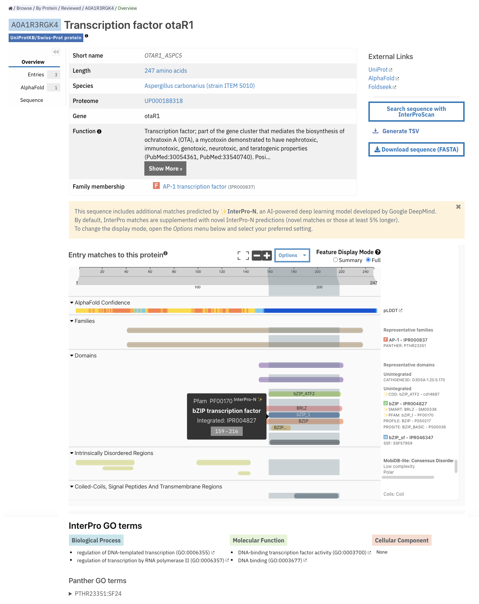

*********************************
Frequently Asked Questions (FAQs)
*********************************

.. contents::
  :local:

.. _A1AA27: https://www.ebi.ac.uk/interpro/protein/UniProt/A1AA27/

What is Pfam?
=============

Pfam is a collection of multiple sequence alignments and profile hidden Markov models (HMMs). Each Pfam profile HMM represents a protein family or domain. 
By searching a protein sequence against the Pfam library of profile HMMs, you can determine which domains it carries i.e. its domain architecture. Pfam 
can also be used to analyse proteomes and questions of more complex domain architectures.

For each Pfam accession, we have an entry page. See :ref:`Searching a specific Pfam entry <search-boxes>` for more information on how to access them.

What is a Pfam entry page?
==========================

On the Pfam entry page you can view all the associated information, from annotation to structure predictions of the protein members. 
See :doc:`Pfam entry page organisation </pfam-entry>` for a detailed description on how this data is presented.

What is a clan/set?
===================

Some of the Pfam entries are grouped into clans. Pfam defines a clan as a collection of entries that have arisen from a single evolutionary origin. 
Evidence of their evolutionary relationship can be in the form of similarity in tertiary structures, or, when structures are not available, from common 
sequence motifs.

When a sequence region has overlapping matches to more than one entry within the same clan, we only show one of those matches. If the sequence region is 
also in the seed alignment for an entry, only the match to that entry is shown. Otherwise we show the entry that corresponds to the match with the lowest 
E-value.

The clan pages can be accessed by following a link from the Pfam entry page, or alternatively they can be accessed by by selecting 
`Browse + By Set <https://www.ebi.ac.uk/interpro/set/all/entry/pfam/#table>`_ in the InterPro website menu and select **Pfam** in the database section.

For each clan page, you can access all the related data. See :doc:`Clan/Set page organisation </clan-set>` for more information. 

What criteria do you use for adding families into clans?
=========================================================

We use a variety of measures. Where possible we do use experimental and predicted structures to guide us and that is always the gold standard. 
We also intend to harmonise this organisation with the `ECOD classification <http://prodata.swmed.edu/ecod/>`_.
In the absence of a structure we use:

  * Profile comparisons such as HHsearch
  * The fact that a sequence significantly matches two profile HMMs in the same region of the sequence
  * A method called SCOOP, that looks for common matches in search results that may indicate a relationship

All of this information is used by the Pfam curators to make a decision about where families are related and we strive to find information in 
the literature that support the relationship, e.g. common function.

What is Pfam-N?
===============
Pfam-N (N for network) provides additional Pfam matches identified by the Google Research team using deep learning approaches. You can read more about 
it `in this initial blog post <https://xfam.wordpress.com/tag/pfam-n/>`_ and `this update <https://xfam.wordpress.com/2022/10/20/a-new-version-of-pfam-n-is-available/>`_. 
The matches for Pfam-N are displayed under the '**Other features**' section in the protein sequence viewer.

  Example of InterPro protein page for the Uniprot accession A1AA27_. The :ref:`protein viewer <protein-viewer>` shows the integrated and unintegrated 
  Pfam entries matching this protein sequence, as well as other features such as the Pfam-N matches. The colour code of the protein viewer is customised as 
  **Colour By + Member Database** for all Pfam entries to be highlighted in blue. The tooltip is active and the mouse was hovering over one of the Pfam-N 
  matches when this screenshot was taken.

What is the relation between Pfam and InterPro?
===============================================

The Pfam database is a large collection of protein domain families. Each family is represented by multiple sequence alignments and a profile hidden 
Markov model (HMM) and has information associated. All the information in the Pfam database can be accessed through the InterPro website, where it is 
hosted. See :doc:`Getting started </getting-started>` for more information.

InterPro is a resource that provides functional analysis of protein sequences by classifying them into families and predicting the presence of 
domains and important sites through the use of predictive models, known as signatures, provided by several collaborating databases (referred to 
as member databases). One of it 13 member databases is Pfam. For further information you can explore the 
`InterPro About pages <https://www.ebi.ac.uk/interpro/about/interpro/>`_.

Members of the :doc:`Pfam team </team-members>` at the EMBL-EBI are also part of the `InterPro team <https://www.ebi.ac.uk/interpro/about/team/>`_. In this way, 
while both protein resources are independently maintained, there is a really close relation between them, with feedback constantly going in both directions to 
improve protein classification.

This Pfam entry is not integrated into InterPro, is it useful anyway?
=====================================================================

Yes! The criteria for creating a new Pfam entry and a new InterPro entry are different. A Pfam entry might not yet be curated in IntePro or might not 
reach InterPro's standards for integration. However, it can still provide very important information about a protein of interest.

Is possible to build Wise2 with HMMER3 support?
===============================================

The way we get round the problem with the difference in HMMER versions, is to convert the profile HMMs that are in HMMER3 format to HMMER2 format using 
the HMMER3 program "hmconvert" (with -2) flag. To make the searches feasible, we screen the DNA for potential domains using ncbi-blast and the 
Pfam-A.fasta as a target library. GeneWise is then used to calculate a subset of profile HMMs against the DNA. There is some down-weighting of the 
bits-per-position between H2 and H3 HMMs that the conversion does not account for, leading inevitably to some false negatives for some families/sequences. 
However, until GeneWise is patched to deal with HMMER3 models, this is the best course of action.

How can I search Pfam locally?
==============================

If you have a large number of sequences or you don't want to post your sequence across the web, you can search your sequence locally using 
`InterProScan <https://interproscan-docs.readthedocs.io/en/latest/Introduction.html#to-install-and-run-interproscan>`_.

Why doesn't Pfam include my sequence?
=====================================

Pfam is built from a fixed release of UniProtKB. At each InterPro release we incorporate sequences from the latest release of UniProtKB. This means that, 
at any time, the sequences used by Pfam might be several weeks behind those in the most up-to-date versions of the sequence databases. If your sequence 
isn't in Pfam, you can still find out what domains it contains by pasting it into the sequence search box (see :ref:`InterPro online sequence search <search-by-sequence>` 
for more information).

Why is there apparent redundancy of UniProtKB IDs in the full-length FASTA sequence file?
=========================================================================================

A given Pfam family may match a single protein sequence multiple times, if the domain/family is a repeating unit, for example, or when the profile HMM 
matches only to short stretches of the sequence but matches several times. In such cases the FASTA file with the full length sequences will contain 
multiple copies of the same sequence.

How can I submit a new domain?
==============================

If you know of a domain that is not present in Pfam, you can submit it to the `Pfam helpdesk <https://www.ebi.ac.uk/about/contact/support/pfam>`_ and we will 
endeavour to build a Pfam entry for it. We ask that you supply us with a multiple sequence alignment of the domain (please send the alignment file as 
a text file (e.g. *.txt*) and not in the format of a specific application such as Microsoft Word (e.g. a *.doc*) file) or a list of Uniprot accessions, 
and associated literature evidence if available.

Can I search my protein against Pfam?
=====================================

Of course! Please look at the :ref:`sequence search <search-by-sequence>` section for instructions on how to do it.

What is the difference between the '-' and '.' characters in your full alignments?
==================================================================================

The '-' and '.' characters both represent gap characters. However they do tell you some extra information about how the profile HMM has generated the alignment. 
The '-' symbols are where the alignment of the sequence has used a delete state in the profile HMM to jump past a match state. This means that the sequence is 
missing a column that the profile HMM was expecting to be there. The '.' character is used to pad gaps where one sequence in the alignment has sequence from 
the profile HMMs insert state. See the alignment below where both characters are used. The profile HMM states emitting each column are shown. Note that residues 
emitted from the Insert (I) state are in lower case.

How can I visualise the position of a Pfam entry in a structure?
================================================================

In the **Structures** tab of a :ref:`Pfam entry <pfstruct>` or a :ref:`Pfam clan/set <clstruct>` page you can find links to relevant InterPro structure 
pages. 

In an InterPro structure page, or each chain of the structure matches to Pfam and other databases and resources are displayed in a 
protein sequence viewer. On top you can see the 3D structure viewer. 

The position of each Pfam entry within the overall 3D structure can be visualised by:
* hovering the mouse over the coloured bar representing the Pfam match in the protein sequence viewer. 
* choosing the Pfam entry of interest in the drop-down list **Highlight Entry in the 3D structure**.

The **AlphaFold** tab of a :ref:`Pfam entry <ap>` provides links to the predicted structure of every protein matching the entry. 
In the **AlphaFold** tab of InterPro protein pages, the position of each Pfam entry within the overall 3D structure can be visualised by hovering the 
mouse over the coloured bar representing the Pfam match in the protein sequence viewer. 

.. figure:: images/apstructviewer.png
  :alt: Example of the AlphaFold tab of an InterPro protein page showing the structure viewer 
  :width: 700
  :align: left

  Example of the AlphaFold tab in the InterPro protein page for the Uniprot accession A1AA27_. When the screenshot was taken, the mouse was hovering over 
  the Pfam entry `PF20258 <https://www.ebi.ac.uk/interpro/entry/pfam/PF20258/>`_.

Why don't you have domain YYYY in Pfam?
=======================================

We are very keen to be alerted to new domains. If you can provide us with a multiple sequence alignment then we will try hard to incorporate it into the 
database. If you know of a domain, but don't have a multiple sequence alignment, we still want to know, for simple families just one sequence is enough. 
Again contact the `Pfam helpdesk <https://www.ebi.ac.uk/about/contact/support/pfam>`_.

Are there other databases which do this?
========================================

To a certain extent yes, there are a number of "second generation" databases which are trying to organise protein space into evolutionarily conserved 
regions. `InterPro <http://www.ebi.ac.uk/interpro>`_ combines information from `several of them <https://www.ebi.ac.uk/interpro/about/consortium/>`_ in a single 
searchable resource.

So which database is better?
============================

As with everything, it depends on your problem: we would certainly suggest using more than one method. Pfam is likely to provide more interpretable results, with 
crisp definitions of domains in a protein. 
