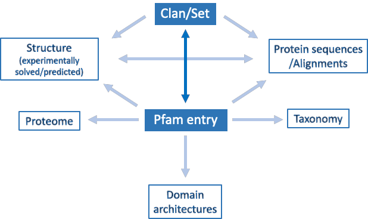

***************
Getting Started
***************

**Pfam** is hosted by `InterPro <https://www.ebi.ac.uk/interpro/>`_. All the information contained within Pfam is accessible in the website of this protein sequences resource by browsing by member database and choosing 
`Pfam <https://www.ebi.ac.uk/interpro/entry/pfam/#table>`_. For more information about InterPro you can have a look at `its documentation <https://interpro-documentation.readthedocs.io/en/latest/interpro.html>`_. 
By clicking on the Docbot icon (|docbot_icon|) at the low right corner, you can also use our specialised AI-based chatbot to find answers to queries about InterPro and the website based on its documentation. 
You may also want to check out our list of `training materials and webinars 
<https://www.ebi.ac.uk/training/search-results?query=pfam&domain=ebiweb_training&page=1&facets=>`_.

.. |docbot_icon| image:: images/icons/docbot_icon.png
  :alt: Docbot icon
  :width: 30pt

Site organisation
=================

  Schematic representation of the organisation of the information in the Pfam database. The arrows represent the flow of data.

Note the InterPro entries use the term **Conserved site** for **Motif** for consistency with the rest of the member databases that form part of `the InterPro consortium <https://www.ebi.ac.uk/interpro/about/consortium/>`_.