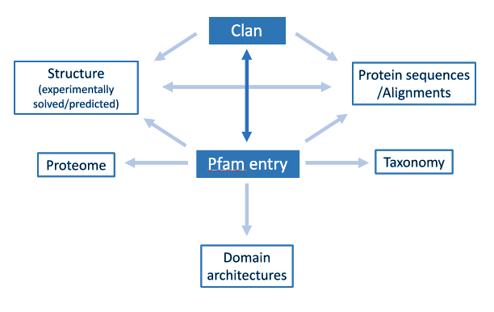

***************
Getting Started
***************
.. _pfam:
**Pfam** is hosted by `InterPro <https://www.ebi.ac.uk/interpro/>`_. All the information contained within Pfam is accesible in the website of this protein sequences resource by browsing by member database and choosing 
`Pfam <https://www.ebi.ac.uk/interpro/entry/pfam/#table>`_. For more information about InterPro you can have a look at `its documentation <https://interpro-documentation.readthedocs.io/en/latest/interpro.html>`_. 

Site organisation
=================

  Schematic representation of the organisation of the information in the Pfam database. The arrows represent the flow of data.

