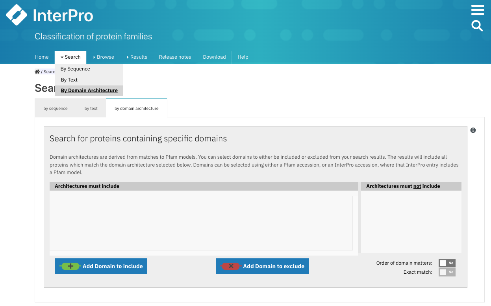

.. _getting-started:

***************
Getting Started
***************

**Pfam** is hosted by `InterPro <https://www.ebi.ac.uk/interpro/>`_. All the information contained within Pfam is accesible in the website of this protein sequences resource by browsing by member database and choosing 
`Pfam <https://www.ebi.ac.uk/interpro/entry/pfam/#table>`_. For more information about InterPro you can have a look at `its documentation <https://interpro-documentation.readthedocs.io/en/latest/interpro.html>`_. 

Site organisation
=================

.. figure:: images/Pfam_entry.png
    :alt: Scheme of the organisation of the information in the Pfam database.
    :width: 400

    :align: center

.. _search:
Users can navigate to specific Pfam entry pages by entering the Pfam identifier or accession number or a keyword that form part of its name via three different **Search boxes**:

1. When selecting the **Browse + By member database** option, the search box is located in the header of the results table.

.. figure:: images/browsebymbdbpfam.png
    :alt: Selecting the 'Browse + By member database' option and Pfam.
    :width: 700
    :align: left

    Example of browsing the Pfam database. A paginated list of all available Pfam enties is displayed. A **Search box** appears on top of this list.

2. After selecting **Search + By text**, a larger text box is shown in the center of the page.

.. figure:: images/searchbytextpf.png
    :alt: Selecting **Search + By text**
    :width: 700
    :align: left

    Example of searching specific Pfam entry pages by entering the Pfam identifier or accession number or a keyword.

3. In the top right corner of any InterPro page, next to the magnifying glass. 

    On the InterPro website header, a search box appears when hovering the mouse next to the magnifying glass at the right; it can be used to search for Pfam information.

This text box allows you to go quickly to the relevant page in the InterPro site, by using:

.. list-table:: **SEARCH BY TEXT**
    :widths: 250 250
    :header-rows: 1

    * - Search
      - Find
    * - Pfam accession number
      - Pfam entry page
    * - Pfam identifier or name
      - Pfam entry page
    * - Set/clan identifier
      - Pfam Set/clan page
    * - UniProt accession
      - IntePro protein page, which includes Pfam matches (with coordinates)
    * - Gene names
      - IntePro protein page, which includes Pfam matches (with coordinates)
    * - PDB identifier
      - IntePro structure page, which includes a 3D visualisation of Pfam matches
    * - Proteomes
      - If it is a reference proteome, the InterPro proteome page will be displayed
    * - Keywords, free text
      - List of possible matches

**Pfam clans** are called **Sets** in the InterPro website. If a Pfam entry is included in a clan this information will be displayed in the **Overview** tab, next to Set, below the Pfam short name, with a link to the corresponding clan/set page. Additionally, it is possible to browse through the Pfam clans by selecting **Browse + By Set** in the `InterPro website menu <https://www.ebi.ac.uk/interpro/set/all/entry/pfam/#table>`_ and select **Pfam** in the database section.

Pfam entry organisation
-----------------------
In each Pfam entry page, different tabs with relevant information are available:

.. figure:: images/overview.png
    :alt: Example of a Pfam entry with the default tab selected (Overview)
    :width: 700
    :align: left

    Example of a Pfam entry `PF02171 <https://www.ebi.ac.uk/interpro/entry/pfam/PF02171/>`_ page. All the tabs explained below can be found on the left-hand menu. The tab **Overview** is displayed by default.

* **Overview**
The entry overview tab is the default display, where the type of Pfam entry, the short name and the clan/set 
(if the entry belongs to any) are shown on top. Usually, a curated description of the entry is displayed below, 
with the relevant literature references. 

If there is a Wikipedia page for the entry, the first paragraph and the box with an image of a 
tridimensional structure and some cross-links are displayed. The full Wikipedia article can be open in a 
new tab by clicking on the title.

* **Proteins**
The list of proteins matching this entry is displayed in this tab. They view can be customised to show:

1. all proteins (from the whole  UniProtKB database)

2. only 'Reviewed' proteins (from SwissProt - manually curated) 

3. only 'Unreviewed' proteins (from TrEMBL - derived from public databases automatically integrated into UniProt)

For each protein, the corresponding protein page in InterPro can be accessed by clicking on the protein accession or name; the InterPro taxonomy page can be accessed by clicking on the species name; and a small-size protein viewer displays the location of the Pfam entry in the protein. Coordinates of the match can be shown by hovering the mouse over it.

* **Domain architectures**
This tab shows the various domain arrangements of the proteins matched by the entry, ordered by the number of times that this architecture is seen. Identifying the different domains present in proteins is crucial to understand how they function.

The protein viewer shows a representative sequence for each domain architecture, with the domain size based on the real length of the domain in the protein. When hovering over a domain, more details are available in a tooltip, including the domain's position. From this page, all related Pfam entry pages can also be accessed by clicking on the Pfam accession at the top of the viewer or on the short names on the right-hand side of the viewer. The list of proteins with this architecture is available by clicking on the protein number.

* **Taxonomy**
This tab shows by default a sunburst chart of all the species that the proteins matched by the Pfam entry belong to.

By default, eight individual nodes that are derived from the taxonomic lineage of each protein sequence, ranging from superkingdom down to species, are displayed. For each node in the taxonomy tree there is a separate ring - and each ring is arranged radially, with the superkingdoms at the centre and the species around the outermost ring. The length of each ring is proportional to the number of proteins found within each taxon. You can choose how many rings you want to see from the right-hand side options.

Segments of the sunburst chart are coloured according to their superkingdom, as explained in the **Legends** section. Mousing over any part of the sunburst chart shows the taxonomic name and level, with both the number of sequences and the number of species found at that level shown on the right-hand side.

These data can also be seen as a table and as a tree. In addition, it is possible to choose to see only data from key species instead. These visualisation options can be chosen from the icon panel above the sunburst.

* **Proteomes**
A list of the reference proteomes matched by the entry is displayed in this tab. Each item in this list shows the Proteome ID (which is a link to the Proteome page in InterPro), the name of the species carrying this proteome and the number of proteins in this proteome that match the entry.

* **Structures**
This tab displays a list of all the PDB structures determined for the proteins matching the Pfam entry. For each structure, you can see the PDB accession, the name of the structure in PDB, and a small-sized protein sequence viewer displaying the location of the Pfam entry in the structure.

Viewing the structures of domains and proteins helps to understand what their function might be, and how individual residues are arranged in the three-dimensional space. Often, two residues which seem distant along the linear protein sequence can be very close in the folded protein. 

By clicking on a PDB accession, name or small image of the structure, a view of the corresponding InterPro structure page that summarises all of the entries of Pfam and other databases and resources for each chain of the structure will be displayed in a protein sequence viewer. The position of each entry within the overall 3D structure can be visualised by choosing the Pfam entry of interest in the drop-down list **Highlight Entry in the 3D structure** or by clicking on the bar corresponding to the entry match in the protein sequence viewer. Additionally, links to similar PDB viewers and cross-references to other structural databases are provided in the **External links** section.

* **Signature**
This tab shows the HMM logo of the Pfam model, visualised using `Skylign <http://www.skylign.org/>`_. HMM logos are one way of visualising profile HMMs. Logos provide a quick overview of the properties of an HMM in a graphical form.

The visualisation displays the amino acid conservation for each residue in the model. The rendered area can be dragged to a desired position to navigate large logos. Alternatively, a specific residue number can be written in the **Model column** text box. When selecting a particular residue in the logo, the probabilities of each amino acid are displayed in the bottom part.

* **AlphaFold**
Many of the proteins found in the Pfam entry may have a predicted structure generated by `AlphaFoldDB <https://alphafold.ebi.ac.uk/>`_. A list of all the predicted structures available in AlphaFoldDB for the proteins belonging to this entry is displayed in this tab. For each protein in the list, its Uniprot accession, name, the species it belongs to, its length, and a button that allows you to show the predicted structure of this protein in the structure viewer are displayed. It is also possible to click on the Uniprot accession to go to the InterPro protein page and go to the **Alphafold** tab, where the position of the different entries in the 3D structure viewer are displayed by clicking on the bar corresponding to the entry match in the protein sequence viewer.

* **Alignment**
Three different alignments can be chosen and visualised in this tab:

1. The **seed** alignment shows the multiple sequence alignment used to create the HMM model in Pfam. This is a representative set of sequences of the family and it normally has a relatively short number of protein sequences.

2. The **full** alignment shows all the protein sequences from the Uniprot Reference proteomes that match this model.

3. The **uniprot** alignment includes all the protein sequences matched by this Pfam model in the whole Uniprot database.

The colour coding of the alignment can be customised through the options available in the **Colors** section.

All the alignments can be downloaded by clicking on the **Download** button.

* **Curation**
This tab is divided into two subsections:

1. In the first section, you can see details about Pfam curators and Sequence ontology.

2. The second section displays the HMM building command used to generate the HMM profile defining the Pfam entry and offers the possibility to download the HMM profile.

Searching a protein sequence against Pfam
=========================================

Searching a protein sequence against the Pfam library of HMMs will enable you to find out the domain architecture of the protein, and thus what its potential function might be. If your protein is present in the version of UniProt used to make the current release of InterPro, we have already calculated its domain architecture. You can access this by entering the Uniprot sequence identifier in any of the Search boxes mentioned above (see :ref:`search`).

Web services
------------

If your sequence is not in the InterPro database, you could perform a single-sequence or a batch search against the Pfam database on the InterPro website. This search uses the web based InterProScan tool, which allows you to scan up 100 sequences at a time with a maximum length of 40,000 amino acids. To run a any online search you can follow this steps:

1. Click the **Search + By Sequence** in the InterPro website menu. This opens the **Search InterPro** page. 

    Selecting **Search + By Sequence** in the InterPro website menu.

2. Provide the FASTA formatted protein sequence(s) of interest by pasting them into the text box or by importing them from a file.

.. figure:: images/fasta.png
    :alt: Selecting **Search + By Sequence** in the InterPro website menu
    :width: 700
    :align: left

    Example of protein sequence in FASTA format in the **Enter your sequence box**.

3. Expand the **Advanced options**, click on **Unselect all** protein sequence applications and select Pfam

.. figure:: images/advanced_pf.png
    :alt: Selecting **Pfam** in the **Advanced options** drop-down
    :width: 700
    :align: left

    Select only **Pfam** to search your sequence(s) against this database.

4. Click the **Search** button

While the sequence search is running, you can continue to navigate through the website, other browser tabs or applications and will get a pop-up notification when the job has been completed (this requires the browser notifications to be enabled).

The results of the submitted job are accessible by selecting **Results + Your InterProScan Searches** in the InterPro website menu. 

.. figure:: images/results.png
    :alt: Selecting **Results + Your InterProScan Searches**
    :width: 700
    :align: left

    Select **Results + Your InterProScan Searches** in the InterPro website menu. 

All Pfam entries - and the InterPro entries where they are integrated - are displayed in the protein sequence viewer. The Pfam and InterPro entries are grouped by type (family, domain, repeat, site). The coloured bars indicate the location of entry matches on the protein sequence. Each matched InterPro entry is displayed on a separate line, with the Pfam entries integrated in it displayed below where pertinent. The Pfam entries that remain unintegrated in InterPro are displayed separately.

.. figure:: images/exampleprotvviewer.png
    :alt: Example of InterPro protein page with the protein viewer
    :width: 700
    :align: left

    Example of InterPro protein page. The integrated and unintegrated Pfam entries matching this protein sequence are shown in the protein viewer.

On top of the sequence viewer, different icons allow to display the viewer on full screen and zoom in and out of the protein sequence. The **Options** button offers the posssibility to personalise the display by changing the colour code of the entries, the labels (accession number, short name and/or description can be displayed on the right-hand side of the viewer), collapsing the visualisation to show InterPro entries only or to display also the contributing entries from the member databases. The tooltip should be kept active to see a pop-up box with the accession number, description and amino acid coordinates of the match of an entry when hovering the mouse over it. Snapshots of the results can be taken in JPEG or PDF format.

Local protein searches
----------------------

If you have a very large number of protein searches to perform, or you do not wish to post your sequence across the web, it may be more convenient to `install and run InterProScan <https://interproscan-docs.readthedocs.io/en/latest/Introduction.html#to-install-and-run-interproscan>`_.

Finding proteins with a specific set of domain combinations (**Domain architectures**)
======================================================================================

Users can search protein sequences that contain specific Pfam entries in a particular arrangement by selecting **Search + By Domain architecture** in the InterPro website menu. Pfam entries that the proteins should or should not contain can be included or excluded from the domain architecture. The **Order of domain matters** option offers the possibility to arrange the domains in a particular order. The **Exact match** option fine tunes the search to find only proteins containing the selected domains (no extra domain in the proteins). Domains can be selected by entering a domain name or Pfam accession.

    Select **Search + By Domain architecture** in the IntePro menu, enter the desired Pfam entries and select/unselect the relevant options.

Pfam entries creation and annotation
====================================

For each Pfam entry, the HMM model is run against the protein sequences belonging to the UniProt Reference Proteomes. Subsequently, Pfam curators set a statistical cut-off, known as a gathering threshold (GA) for an entry. Sequences failing to make a statistical match above this threshold are not reported as hits. The threshold is usually conservative, so that no known false positives are included in the entry. The Pfam model is then run against the whole UniProtKB database before every realease and these are the matches shown on the website.

Different Pfam entries have annotations providing diverse amounts of information. Many of them have a description created by Pfam curators. Anyone can contribute to this annotation by contacting directly the curators through the **Add your annotation** toolbox located on the right-hand side of the **Overview** tab.

.. figure:: images/annotation.png
    :alt: Give feedback to the curators. 
    :width: 700
    :align: left

    Select **Add your annotation** to give feedback to curators.

In addition, Pfam encourages the annotation of Pfam families via Wikipedia. Below the traditional description of the Pfam entry, you may find the text from a Wikipedia article that we feel provides a good description of the Pfam family. 
If a family does not yet have a Wikipedia article assigned to it, there are several ways for you to help us add one. You can find much more information about the process in the :ref:`wikipedia` section. 

