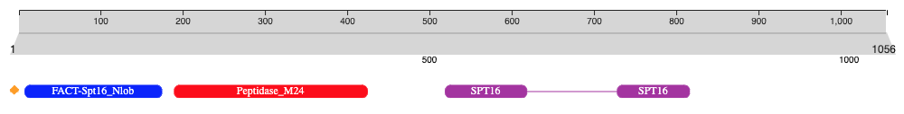
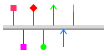

###################
Generating graphics
###################

We provide different tools to generate graphical representation of the features found within a sequence.
There are a variety of different shapes and styles and each one has a particular meaning. This page gives an in-depth description 
of the elements of the library from the :ref:`Nightingale component <nightingale>` and the :ref:`Domain graphic tool <guide-to-graphics>`.

.. _nightingale:

Domain visualisation using Nightingale
======================================

The `Nightingale component <https://github.com/ebi-webcomponents/nightingale>`_ is used throughout the `InterPro website <https://www.ebi.ac.uk/interpro>`_ to display protein features in the protein sequence viewer. We provide a tool that allows to generate a 
personalised representation of protein features using `Nightingale v4 <https://codepen.io/typhainepl/pen/qBLZpgr>`_.

In the JavaScript part in the link above, you can edit the *sequence* and *feature* variables to display the features for your protein of interest. 
You can then take a screenshot of the graphical representation generated.

For each component, you can specific the following parameters:

.. code-block:: javascript

  { // family/single domain
    accession: "PF14826",
    start: 19,
    end: 181,
    color: "blue",
    short_name: "FACT-Spt16_Nlob",
    shape:"roundRectangle" 
  },

  { // discontinuous domain
    accession: "PF08644",
    locations: [{ fragments: [{ start: 520, end: 616 }, { start: 725, end: 810 }] }], 
    color: "#A42ea2",
    short_name: "SPT16",
    shape:"roundRectangle"
  }

Recommended shapes:

- Family or domain components are rendered as rectangles with curved ends (roundRectangle), while other components are represented by rectangle shapes
- Repeat/motif: rectangle
- Other sequence motifs (e.g. signal peptides, low complexity regions, coiled-coils and transmembrane regions): rectangle
- disulphide bridges: bridge
- signal peptide: diamond

  
  Example of a domain visualisation using Nightingale v4.

For more information about how to use the Nightingale component, you can have a look at `its documentation 
<https://ebi-webcomponents.github.io/nightingale/?path=/story/introduction--page>`_.

.. _guide-to-graphics:

Domain graphics tool
====================

The domain graphics tool provides graphical representation of the features found within a sequence, termed domain graphics. 
There are a variety of different shapes and styles and each one has a particular meaning. This page gives an in-depth description 
of the elements of the Domain graphics library.
Please note that we do not recommend to use this tool anymore, but to use the :ref:`nightingale` instead.

The library that generates the images in this page uses a `JSON <http://en.wikipedia.org/wiki/Json>`_ string to describe the domain graphic. 

You can generate your own graphics using the `domain graphics library <https://github.com/ProteinsWebTeam/domain-gfx>`_ available on github.

The sequence
------------

The base sequence, undecorated by any domains or features, is represented by a plain grey bar: 

.. code-block:: json

  { 
    "length" : "400"
  }

The length of the domain graphic that is drawn is proportional to the length of the sequence itself. Any domains or features which 
are drawn on the sequence are also scaled by the same factor. 

Pfam-A
------

The high quality, curated *Pfam-A* domains are classified into one of six different types: *family, domain, coiled-coil, disordered, 
repeat* and *motif* (for more details see :doc:`Summary 
`). These different classification types are rendered slightly differently.

Family/domain
^^^^^^^^^^^^^

It is possible for a sequence to match either the full length of a Pfam HMM (a full length match), or to match a portion of an HMM 
(a fragment match). The two types of match are rendered differently.

Both *family* and *domain* entries are rendered as rectangles with curved ends when the sequence is a full length match. Different 
types of domain are displayed with different colours. When the domain image is long enough, the domain name is shown within the domain 
itself. In most cases, you can click on the domains to visit the "family page" for that domain. Moving the mouse over the domain image 
should also display a tooltip showing the domain name, as well as the start and end positions of the domain. 

 

.. code-block:: json
 
  { 
    "length" : "400",  
    "regions" : [  
      {  
        "type" : "pfama",  
        "text" : "Domain",  
        "colour" : "#9999ff",  
        "display": "true", 
        "startStyle" : "curved", 
        "endStyle" : "curved", 
        "start" : "40", 
        "end" : "200", 
        "aliStart" : "50",
        "aliEnd" : "175"
      }, 
      { 
        "type" : "pfama", 
        "text" : "LongFamilyNamesNotShown", 
        "colour" : "#399", 
        "display" : true, 
        "startStyle" : "straight", 
        "endStyle" : "straight", 
        "start" : "210",
        "end" : "250", 
        "aliStart" : "215",
        "aliEnd" : "245"
      } 
    ] 
  }

From Pfam 24.0 onwards, Pfam has been generated using `HMMER3 <http://hmmer.org/>`_, which introduces the concept of "envelope 
coordinates" for a match. Envelope regions are represented in domain graphics as lighter coloured regions. The graphic above 
shows short envelope regions at the ends of both domains.

When the sequence does not match the full length of the HMM that models a Pfam entry, matching domain fragments are shown. 
When a sequence match does not pass through the first position in the HMM, the N-terminal side of the domain graphic is drawn 
with a jagged edge instead of a curved edge. Similarly, when a sequence match does not pass through the last position of the HMM, 
the C-terminal side of the domain graphic is drawn with a jagged edge. In some rarer cases, the sequence match may not pass 
through either of the first or last positions of the HMM, in which case both sides are drawn with jagged edges. Examples of all 
three cases are shown below.

.. code-block:: json

  { 
    "length" : "400",  
    "regions" : [  
      {  
        "type" : "pfama",  
        "text" : "PartN",  
        "colour" : "#9999ff",  
        "display": "true", 
        "startStyle" : "jagged", 
        "endStyle" : "curved", 
        "start" : "10", 
        "end" : "110"
      }, 
      { 
        "type" : "pfama", 
        "text" : "PartN_C", 
        "colour" : "#399", 
        "display" : true, 
        "startStyle" : "jagged", 
        "endStyle" : "jagged", 
        "start" : "115",
        "end" : "204"
      },
      { 
        "type" : "pfama", 
        "text" : "PartC", 
        "colour" : "#1fc01f", 
        "display" : true, 
        "startStyle" : "curved", 
        "endStyle" : "jagged", 
        "start" : "210",
        "end" : "350"
      } 
    ] 
  }

Repeat/motif
^^^^^^^^^^^^
 
*Repeats* and *motifs* are types of Pfam domain which do not form independently folded units. In order to distinguish them from 
domains of type family and domain, repeats and motifs are represented by rectangles with straight edges. As for families and 
domains, partial matches are represented with jagged edges.  

.. code-block:: json

  { 
    "length" : "200",  
    "regions" : [  
      {  
        "type" : "pfama",  
        "text" : "HEAT",  
        "colour" : "#1fc01f",  
        "display": "true", 
        "startStyle" : "straight", 
        "endStyle" : "straight", 
        "start" : "2", 
        "end" : "34"
      }, 
      {  
        "type" : "pfama",  
        "text" : "HEAT",  
        "colour" : "#1fc01f",  
        "display": "true", 
        "startStyle" : "straight", 
        "endStyle" : "straight", 
        "start" : "82", 
        "end" : "118"
      }, 
      {  
        "type" : "pfama",  
        "text" : "HEAT",  
        "colour" : "#1fc01f",  
        "display": "true", 
        "startStyle" : "straight", 
        "endStyle" : "straight", 
        "start" : "120", 
        "end" : "155"
      }, 
      {  
        "type" : "pfama",  
        "text" : "HEAT",  
        "colour" : "#1fc01f",  
        "display": "true", 
        "startStyle" : "straight", 
        "endStyle" : "straight", 
        "start" : "159", 
        "end" : "195"
      }
    ] 
  }
 
Discontinuous nested domains
^^^^^^^^^^^^^^^^^^^^^^^^^^^^

Some domains in Pfam are disrupted by the insertion of another domain (or domains) within them. A number of names have been given 
to this arrangement: *discontinuous* (referring to the outer domain), *inserted* or *nested* (both referring to the inner domain). 
For example, in many sequences containing an `IMPDH domain (PF00478) <https://www.ebi.ac.uk/interpro/entry/pfam/PF00478/>`_, the 
IMPDH domain is continuous along the primary sequence. However, in some cases the linear sequence of the IMPDH domain is broken 
by the insertion of a `CBS domain (PF00571) <https://www.ebi.ac.uk/interpro/entry/pfam/PF00571/>`_, as shown below.

Where three-dimensional structures are available for representatives of a Pfam domain, it is generally clear that the three-dimensional 
arrangement of the domain containing the nested domain is maintained. Typically the nested domain is found inserted within a surface 
exposed loop, having little or no effect on the structure of the other domain. Such an arrangement explains why and how these nested 
domains can be functionally tolerated.

To represent this arrangement of domain graphically, the discontinuous domain is represented in two parts (as shown below). These two 
parts are joined by a line bridging them. 
 

.. code-block:: json

  { 
    "length" : "200",  
    "regions" : [  
      {  
        "type" : "pfama",  
        "text" : "IMPDH",  
        "colour" : "#1fc01f",  
        "display": "true", 
        "startStyle" : "curved", 
        "endStyle" : "jagged", 
        "start" : "5", 
        "end" : "80"
      }, 
      {  
        "type" : "pfama",
        "text" : "CBS",  
        "colour" : "#c00f0f",  
        "display": "true", 
        "startStyle" : "curved", 
        "endStyle" : "curved", 
        "start" : "81",
        "end" : "135"
      }, 
      {  
        "type" : "pfama",  
        "text" : "IMPDH",
        "colour" : "#1fc01f",  
        "display": "true", 
        "startStyle" : "jagged", 
        "endStyle" : "curved", 
        "start" : "136", 
        "end" : "197"
      }
    ],
    "markups" : [ 
      { 
        "type" : "Nested", 
        "colour" : "#000000", 
        "display" : true, 
        "v_align" : "top", 
        "start" : "76", 
        "end" : "136"
      }
    ]
  } 

Other sequence motifs
---------------------

In addition to domains, smaller sequences motifs are represented by the domain graphics. Currently the following motifs are represented: 
*signal peptides*, *low complexity regions*, *coiled-coils* and *transmembrane regions*. These usually take lower priority than other 
regions that are drawn and they are therefore often obscured by, for example, a Pfam-A graphic being drawn over the top of them. An 
example of each motif is shown below. 

.. code-block:: json

  { 
    "length" : "200", 
    "motifs" : [ 
      { 
        "type" : "sig_p", 
        "colour" : "#ff9c00", 
        "display" : true, 
        "start" : 1, 
        "end" : 27
      }, 
      { 
        "type" : "low_complexity", 
        "colour" : "#0FF", 
        "display" : true, 
        "start" : 39, 
        "end" : 47
      }, 
      { 
        "type" : "low_complexity", 
        "colour" : "#0FF", 
        "display" : true, 
        "start" : 67, 
        "end" : 76
      }, 
      { 
        "type" : "coiled_coil", 
        "colour" : "#9cff00", 
        "display" : true, 
        "start" : 103, 
        "end" : 123
      }, 
      { 
        "type" : "transmembrane", 
        "colour" : "#F00", 
        "display" : true, 
        "start" : 155, 
        "end" : 175
      }, 
      { 
        "type" : "transmembrane", 
        "colour" : "#F00", 
        "display" : true, 
        "start" : 180, 
        "end" : 195
      }
    ] 
  }

Signal peptides
^^^^^^^^^^^^^^^

*Signal peptides* are short regions (<60 residues long) found at the N-terminus of proteins, which direct the post-translational transport 
of a protein and are subsequently removed by peptidases. More specifically, a signal peptide is characterised by a short hydrophobic helix 
(approximately 7-15 residues). This helix is preceded by a slight positively charged region of highly variable length (approximately 1-12 residues). 
Between the hydrophobic helix and the cleavage site is a somewhat polar and uncharged region, of between 3 and 8 amino-acids. In InterPro, we use 
`Phobius <http://phobius.cgb.ki.se/>`_ and `SignalP <https://services.healthtech.dtu.dk/service.php?SignalP-5.0>`_ for the prediction of signal 
peptides and they can be represented graphically by a small orange box.

Low complexity regions
^^^^^^^^^^^^^^^^^^^^^^

*Low complexity regions* are regions of biased sequence composition, usually comprised of different types of repeats. These regions have been 
shown to be functionally important in some proteins, but they are generally not well understood and are masked out to focus on globular 
domains within the protein.

The presence of a low complexity region can be indicated by a cyan rectangle.

Disordered regions
^^^^^^^^^^^^^^^^^^

We use `MobiDB-lite <https://www.mobidb.org/>`_ for the prediction of disordered regions in the query sequence.

Coiled-coils
^^^^^^^^^^^^

*Coiled coils* are motifs found in proteins that structurally form alpha-helices that wrap or wind around each other. Normally, two to three 
helices are involved, but cases of up to seven alpha-helices have been reported. Coiled-coils are found in a wide variety of proteins, many 
functionally very important. In InterPro they are obtained from COILS. 

Coiled-coils can be represented by a small lime-green rectangle.

Transmembrane regions
^^^^^^^^^^^^^^^^^^^^^

Integral membrane proteins contain one or more *transmembrane regions* that are comprised of an alpha-helix that passes through or "spans" 
a membrane. Transmembrane helices are quite variable in length, with the average being about 20 amino-acids in length. 
`Phobius <http://phobius.cgb.ki.se/>`_ and `TMHMM <https://services.healthtech.dtu.dk/service.php?TMHMM-2.0>`_ are used for the annotation 
of transmembrane regions, which can be represented by a red rectangle.

Other Sequence features
-----------------------

Below is a demonstration of how *disulphide bridges* and *active site residues* can be represented. Each of these features can appear 
above or below the sequence, but in the example below the disulphide bridges are shown above the sequence and the active site residues below the line.

.. code-block:: json

  {
    "length" : "400",
    "regions" : [
      {
        "colour" : "#1fc01f",
        "endStyle" : "curved",
        "startStyle" : "curved",
        "display" : true,
        "end" : "104",
        "href" : "/family/Inhibitor_I29",
        "text" : "Inhibitor_I29",
        "metadata" : {
          "scoreName" : "e-value",
          "score" : "1.3e-38",
          "description" : "Inhibitor_I29",
          "accession" : "PF08246",
          "end" : "104",
          "database" : "pfam",
          "identifier" : "Inhibitor_I29",
          "type" : "Domain",
          "start" : "48"
        },
        "type" : "pfama",
        "start" : "48"
      },
      {
        "colour" : "#c00f0f",
        "endStyle" : "curved",
        "startStyle" : "curved",
        "display" : true,
        "end" : "343",
        "href" : "/family/Peptidase_C1",
        "text" : "Peptidase_C1",
        "modelLength" : "307",
        "metadata" : {
          "scoreName" : "e-value",
          "score" : "1.3e-38",
          "description" : "Peptidase_C1",
          "accession" : "PF00112",
          "end" : "343",
          "database" : "pfam",
          "identifier" : "Peptidase_C1",
          "type" : "Domain",
          "start" : "134"
        },
        "type" : "pfama",
        "start" : "134"
      }
    ],
    "markups" : [
      {
        "lineColour" : "#CCC",
        "colour" : "#CCC",
        "display" : true,
        "end" : "196",
        "v_align" : "top",
        "metadata" : {
          "database" : "pfam",
          "type" : "Disulphide, 155-196",
          "end" : "196",
          "start" : "155"
        },
        "type" : "Disulphide",
        "start" : "155"
      },
      {
        "lineColour" : "#CCC",
        "colour" : "#CCC",
        "display" : true,
        "end" : "228",
        "v_align" : "top",
        "metadata" : {
          "database" : "pfam",
          "type" : "Disulphide, 189-228",
          "end" : "228",
          "start" : "189"
        },
        "type" : "Disulphide",
        "start" : "189"
      },
      {
        "lineColour" : "#CCC",
        "colour" : "#CCC",
        "display" : true,
        "end" : "333",
        "v_align" : "top",
        "metadata" : {
          "database" : "pfam",
          "type" : "Disulphide, 286-333",
          "end" : "333",
          "start" : "286"
        },
        "type" : "Disulphide",
        "start" : "286"
      },
      {
        "lineColour" : "#000",
        "colour" : "#F36",
        "display" : true,
        "residue" : "C",
        "headStyle" : "diamond",
        "v_align" : "bottom",
        "type" : "Active site",
        "metadata" : {
          "database" : "pfam",
          "description" : "Active site, C158",
          "start" : "158"
        },
        "start" : "158"
      },
      {
        "lineColour" : "#000",
        "colour" : "#90C",
        "display" : true,
        "residue" : "H",
        "headStyle" : "diamond",
        "v_align" : "bottom",
        "type" : "Pfam predicted active site, H292",
        "metadata" : {
          "database" : "pfam",
          "description" : "Pfam predicted active site, H292",
          "start" : "292"
        },
        "start" : "292"
      },
      {
        "lineColour" : "#000",
        "colour" : "#F6F",
        "display" : true,
        "residue" : "N",
        "headStyle" : "diamond",
        "v_align" : "bottom",
        "type" : "Pfam predicted active site, N308",
        "metadata" : {
          "database" : "pfam",
          "description" : "Pfam predicted active site, N308",
          "start" : "308"
        },
        "start" : "308"
      }
    ],
    "motifs" : [
      {
        "colour" : "#ff9c00",
        "metadata" : {
          "database" : "seq",
          "type" : "Signal peptide",
          "end" : "26",
          "start" : "1"
        },
        "type" : "sig_p",
        "display" : true,
        "end" : 26,
        "start" : 1
      }
    ]
  }

Disulphide bridges
^^^^^^^^^^^^^^^^^^

*Disulphide bridges* play a fundamental role in the folding and stability of some proteins. They are formed by covalent bonding between 
the thiol groups from two cysteine residues. The disulphide bridge annotations can be represented by a solid bridge-shaped line. 
When multiple disulphide bonds occur, the heights of the bridges are adjusted to avoid overlaps between them. Inter-protein disulphides 
are represented by single vertical lines. Moving the mouse over the "bridge graphic" shows the details of the bond in a tooltip. 

Active site residues
^^^^^^^^^^^^^^^^^^^^

Within an enzyme, a small number of residues are directly involved in catalysis of a reaction. These are termed *active site residues*. 
Within Pfam there are three categories of active site: those that are experimentally determined, those that are predicted by UniProt 
and those predicted by Pfam. All three types can be represented by a "lollipop" with a diamond head. The head is coloured red, pink and purple 
for each of the three types respectively.

"Lollipops"
^^^^^^^^^^^

A wide range of different lollipop styles can be create by combining different line and head colours with different drawing styles. 
The lollipop head can be drawn as a square, circle or diamond, as a simple coloured bar, or as an arrow (pointing away from the sequence) 
or a "pointer" (an arrow pointing towards the sequence). 

.. code-block:: json

  {
    "length" : "200",
    "markups" : [
      {
        "lineColour" : "#666",
        "colour" : "#F36",
        "display" : true,
        "v_align" : "top",
        "headStyle" : "square",
        "type" : "Red square, above sequence",
        "start" : "20"
      },
      {
        "lineColour" : "#F00",
        "colour" : "#F0F",
        "display" : true,
        "v_align" : "bottom",
        "headStyle" : "square",
        "type" : "Purple square, red line, below sequence",
        "start" : "40"
      },
      {
        "lineColour" : "#666",
        "colour" : "#F00",
        "display" : true,
        "v_align" : "top",
        "headStyle" : "diamond",
        "type" : "Red diamond, above sequence",
        "start" : "60"
      },
      {
        "lineColour" : "#666",
        "colour" : "#0F0",
        "display" : true,
        "v_align" : "bottom",
        "headStyle" : "circle",
        "type" : "Green circle, below sequence",
        "start" : "80"
      },
      {
        "lineColour" : "#666",
        "colour" : "#0F0",
        "display" : true,
        "v_align" : "top",
        "headStyle" : "arrow",
        "type" : "Green arrow, above sequence",
        "start" : "100"
      },
      {
        "lineColour" : "#666",
        "colour" : "#08F",
        "display" : true,
        "v_align" : "bottom",
        "headStyle" : "pointer",
        "type" : "Blue pointer, below sequence",
        "start" : "120"
      },
      {
        "lineColour" : "#666",
        "colour" : "#F80",
        "display" : true,
        "v_align" : "top",
        "headStyle" : "line",
        "type" : "Orange line, above sequence",
        "start" : "140"
      }
    ]
  }

Tooltips
--------

If appropriate metadata are present in the sequence description, the domain graphics library can also add tooltips to the image. The example 
below shows a domain graphic and its description includes the necessary metadata for generating tooltips.

.. code-block:: json

  { 
    "length" : "950", 
    "regions" : [ 
      { 
        "modelStart" : "5", 
        "modelEnd" : "292", 
        "colour" : "#2dcf00", 
        "endStyle" : "jagged", 
        "startStyle" : "jagged", 
        "display" : true, 
        "end" : "361", 
        "aliEnd" : "361", 
        "href" : "/family/PF00082", 
        "text" : "Peptidase_S8", 
        "modelLength" : "307", 
        "metadata" : { 
          "scoreName" : "e-value", 
          "score" : "1.3e-38", 
          "description" : "Subtilase family", 
          "accession" : "PF00082", 
          "end" : "587", 
          "database" : "pfam", 
          "aliEnd" : "573", 
          "identifier" : "Peptidase_S8", 
          "type" : "Domain", 
          "aliStart" : "163", 
          "start" : "159" 
        }, 
        "type" : "pfama", 
        "aliStart" : "163", 
        "start" : "159" 
      }, 
      { 
        "modelStart" : "5", 
        "modelEnd" : "292", 
        "colour" : "#2dcf00", 
        "endStyle" : "jagged", 
        "startStyle" : "jagged", 
        "display" : true, 
        "end" : "587", 
        "aliEnd" : "573", 
        "href" : "/family/PF00082", 
        "text" : "Peptidase_S8", 
        "modelLength" : "307", 
        "metadata" : { 
          "scoreName" : "e-value", 
          "score" : "1.3e-38", 
          "description" : "Subtilase family", 
          "accession" : "PF00082", 
          "end" : "587", 
          "database" : "pfam", 
          "aliEnd" : "573", 
          "identifier" : "Peptidase_S8", 
          "type" : "Domain", 
          "aliStart" : "163", 
          "start" : "159" 
        }, 
        "type" : "pfama", 
        "aliStart" : "470", 
        "start" : "470" 
      }, 
      { 
        "modelStart" : "12", 
        "modelEnd" : "100", 
        "colour" : "#ff5353", 
        "endStyle" : "curved", 
        "startStyle" : "jagged", 
        "display" : true, 
        "end" : "469", 
        "aliEnd" : "469", 
        "href" : "/family/PF02225", 
        "text" : "PA", 
        "modelLength" : "100", 
        "metadata" : { 
          "scoreName" : "e-value", 
          "score" : "7.1e-09", 
          "description" : "PA domain", 
          "accession" : "PF02225", 
          "end" : "469", 
          "database" : "pfam", 
          "aliEnd" : "469", 
          "identifier" : "PA", 
          "type" : "Family", 
          "aliStart" : "385", 
          "start" : "362" 
        }, 
        "type" : "pfama", 
        "aliStart" : "385", 
        "start" : "362" 
      }, 
      { 
        "modelStart" : "1", 
        "modelEnd" : "112", 
        "colour" : "#5b5bff", 
        "endStyle" : "curved", 
        "startStyle" : "curved", 
        "display" : true, 
        "end" : "726", 
        "aliEnd" : "726", 
        "href" : "/family/PF06280", 
        "text" : "DUF1034", 
        "modelLength" : "112", 
        "metadata" : { 
          "scoreName" : "e-value", 
          "score" : "1.1e-13", 
          "description" : "Fn3-like domain (DUF1034)", 
          "accession" : "PF06280", 
          "end" : "726", 
          "database" : "pfam", 
          "aliEnd" : "726", 
          "identifier" : "DUF1034", 
          "type" : "Domain", 
          "aliStart" : "613", 
          "start" : "613" 
        }, 
        "type" : "pfama", 
        "aliStart" : "613", 
        "start" : "613" 
      } 
    ], 
    "markups" : [ 
      { 
        "lineColour" : "#ff0000", 
        "colour" : "#000000", 
        "display" : true, 
        "end" : "470", 
        "v_align" : "top", 
        "metadata" : { 
          "database" : "pfam", 
          "type" : "Link between discontinuous regions", 
          "end" : "470", 
          "start" : "361" 
        }, 
        "type" : "Nested", 
        "start" : "361" 
      }, 
      { 
        "lineColour" : "#333333", 
        "colour" : "#e469fe", 
        "display" : true, 
        "residue" : "S", 
        "headStyle" : "diamond", 
        "v_align" : "top", 
        "type" : "Pfam predicted active site", 
        "metadata" : { 
          "database" : "pfam", 
          "description" : "S Pfam predicted active site", 
          "start" : "538" 
        }, 
        "start" : "538" 
      }, 
      { 
        "lineColour" : "#333333", 
        "colour" : "#e469fe", 
        "display" : true, 
        "residue" : "D", 
        "headStyle" : "diamond", 
        "v_align" : "top", 
        "type" : "Pfam predicted active site", 
        "metadata" : { 
          "database" : "pfam", 
          "description" : "D Pfam predicted active site", 
          "start" : "185" 
        }, 
        "start" : "185" 
      }, 
      { 
        "lineColour" : "#333333", 
        "colour" : "#e469fe", 
        "display" : true, 
        "residue" : "H", 
        "headStyle" : "diamond", 
        "v_align" : "top", 
        "type" : "Pfam predicted active site", 
        "metadata" : { 
          "database" : "pfam", 
          "description" : "H Pfam predicted active site", 
          "start" : "235" 
        }, 
        "start" : "235" 
      } 
    ], 
    "metadata" : { 
      "database" : "uniprot", 
      "identifier" : "Q560V8_CRYNE", 
      "organism" : "Cryptococcus neoformans (Filobasidiella neoformans)", 
      "description" : "Putative uncharacterized protein", 
      "taxid" : "5207", 
      "accession" : "Q560V8" 
    }, 
    "motifs" : [ 
      { 
        "colour" : "#ffa500", 
        "metadata" : { 
          "database" : "Phobius", 
          "type" : "sig_p", 
          "end" : "23", 
          "start" : "1" 
        }, 
        "type" : "sig_p", 
        "display" : true, 
        "end" : 23, 
        "start" : 1 
      }, 
      { 
        "colour" : "#00ffff", 
        "metadata" : { 
          "database" : "seg", 
          "type" : "low_complexity", 
          "score" : "2.5100", 
          "end" : "21", 
          "start" : "3" 
        }, 
        "type" : "low_complexity", 
        "display" : false, 
        "end" : 21, 
        "start" : 3 
      }, 
      { 
        "colour" : "#86bcff", 
        "metadata" : { 
          "database" : "seg", 
          "type" : "low_complexity", 
          "score" : "1.4900", 
          "end" : "156", 
          "start" : "134" 
        }, 
        "type" : "low_complexity", 
        "display" : true, 
        "end" : "156", 
        "start" : "134" 
      }, 
      { 
        "colour" : "#00ffff", 
        "metadata" : { 
          "database" : "seg", 
          "type" : "low_complexity", 
          "score" : "2.0200", 
          "end" : "187", 
          "start" : "173" 
        }, 
        "type" : "low_complexity", 
        "display" : false, 
        "end" : "187", 
        "start" : "173" 
      }, 
      { 
        "colour" : "#00ffff", 
        "metadata" : { 
          "database" : "seg", 
          "type" : "low_complexity", 
          "score" : "2.0800", 
          "end" : "218", 
          "start" : "207" 
        }, 
        "type" : "low_complexity", 
        "display" : false, 
        "end" : "218", 
        "start" : "207" 
      }, 
      { 
        "colour" : "#00ffff", 
        "metadata" : { 
          "database" : "seg", 
          "type" : "low_complexity", 
          "score" : "2.1300", 
          "end" : "231", 
          "start" : "220" 
        }, 
        "type" : "low_complexity", 
        "display" : false, 
        "end" : "231", 
        "start" : "220" 
      }, 
      { 
        "colour" : "#00ffff", 
        "metadata" : { 
          "database" : "seg", 
          "type" : "low_complexity", 
          "score" : "2.0000", 
          "end" : "554", 
          "start" : "538" 
        }, 
        "type" : "low_complexity", 
        "display" : false, 
        "end" : "554", 
        "start" : "538" 
      }, 
      { 
        "colour" : "#86bcff", 
        "metadata" : { 
          "database" : "seg", 
          "type" : "low_complexity", 
          "score" : "1.9100", 
          "end" : "590", 
          "start" : "578" 
        }, 
        "type" : "low_complexity", 
        "display" : true, 
        "end" : "590", 
        "start" : 588 
      }, 
      { 
        "colour" : "#00ffff", 
        "metadata" : { 
          "database" : "seg", 
          "type" : "low_complexity", 
          "score" : "1.7600", 
          "end" : "831", 
          "start" : "822" 
        }, 
        "type" : "low_complexity", 
        "display" : false, 
        "end" : "831", 
        "start" : "822" 
      } 
    ] 
  }

