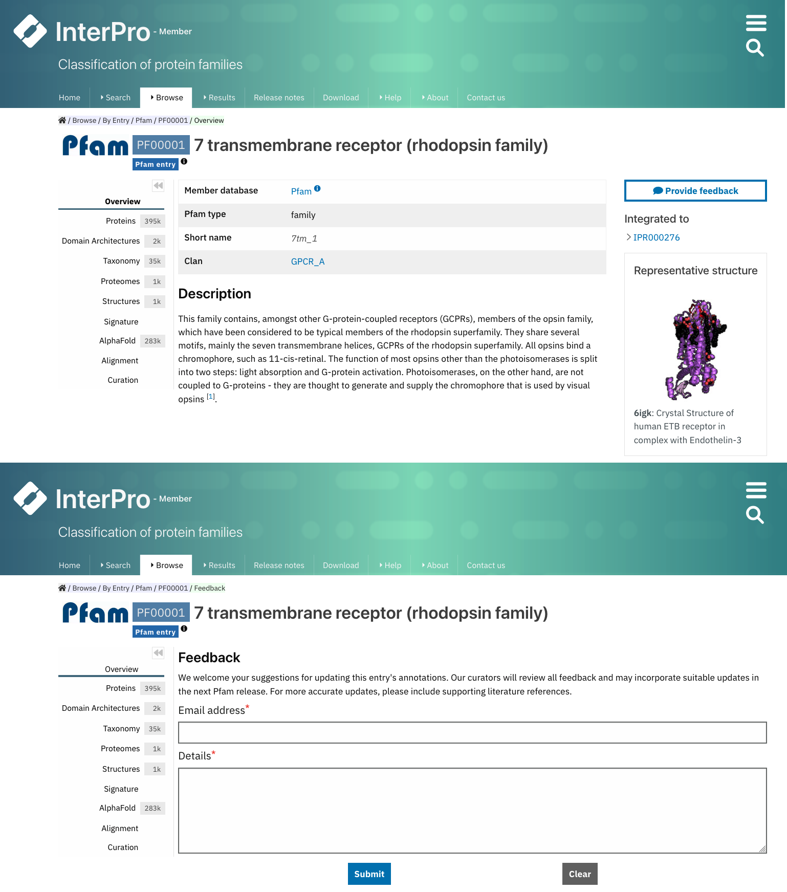

****************************
Pfam entry page organisation
****************************

.. _PF02171: https://www.ebi.ac.uk/interpro/entry/pfam/PF02171/

In each Pfam entry page, different tabs with relevant information are available, as shown in the figure below.

.. figure:: images/overview.png
  :alt: Example of a Pfam entry with the default tab selected (Overview)
  :width: 700
  :align: left

  Example of a Pfam entry page (PF02171_). All the tabs explained 
  below can be found on the left-hand side menu. The **Overview** tab is displayed by default.

Overview
========

The entry overview tab is the default display, where the type of Pfam entry, the short name and the clan (if the entry belongs to any) are shown at the top, 
more information about how clans are defined can be found in :doc:`Summary 
`. Usually, a curated description of the entry is displayed below, with the relevant 
literature references. 

If there is a Wikipedia page for the entry, the first paragraph and the box with an image of a tridimensional structure and some cross-links are displayed. The full 
Wikipedia article can be open in a new tab by clicking on the title.

.. _proteins:

Proteins
========

The list of proteins matching this entry is displayed in this tab. This view can be customised to show:

1. **All** proteins (from the whole UniProtKB database).

2. Only **Reviewed** proteins (from SwissProt - manually curated).

3. Only **Unreviewed** proteins (from TrEMBL - derived from public databases automatically integrated into UniProt).

For each protein, the corresponding protein page in InterPro can be accessed by clicking on the protein accession or name; the InterPro taxonomy page can be 
accessed by clicking on the species name; and a small-size protein viewer displays the location of the Pfam entry in the protein. The coordinates of the match 
can be shown by hovering the mouse over it. You can also export this data in different formats, by clicking on the **Export** button, and customise the page 
settings, by clicking on the wheel icon.

.. figure:: images/pfproteins.png
  :alt: Example of a Pfam entry with the tab Proteins selected.
  :width: 700
  :align: left
  
  Example of a Pfam entry page (PF02171_) with the **Proteins** tab selected. The table is customised to show only **Reviewed** proteins. 
  The screenshot was taken when hovering the mouse over the small-size protein viewer of Uniprot 
  `Q6QME8 <https://www.ebi.ac.uk/interpro/protein/reviewed/Q6QME8/>`_.

Domain architectures
====================

This tab shows the various domain arrangements of the proteins matched by the entry, ordered in descending order by the number of times that 
this architecture is seen. Identifying the different domains present in proteins is crucial to understand how they function.

The protein viewer displays a representative sequence for each domain architecture, where the domain size is based on the real length 
of the domain in the protein. When hovering over a domain, more details are shown in a tooltip, including the domain's position. 

From this page, all related Pfam entry pages can also be accessed by clicking on a Pfam accession at the top of the viewer 
or on a short name on the right-hand side of the viewer. The list of proteins with this architecture is available by 
clicking on the protein number.

.. figure:: images/pfdomarch.png
  :alt: Example of a Pfam entry with the Domain architectures tab selected.
  :width: 700
  :align: left

  Example of a Pfam entry page (PF02171_) with the tab **Domain architectures** selected.

Taxonomy
========

This tab shows by default a sunburst chart of all the species that the proteins matched by the Pfam entry belong to.

By default, eight individual nodes that are derived from the taxonomic lineage of each protein sequence, ranging from 
superkingdoms down to species, are displayed. For each node in the taxonomy tree there is a separate ring - and each ring 
is arranged radially, with the superkingdoms at the centre and the species around the outermost ring. The length of each 
ring is proportional to the number of proteins found within each taxon. You can choose how many rings you want to see 
from the options on the right-hand side of the page.

Segments of the sunburst chart are coloured according to their superkingdom, as explained in the **Legends** section. 
Mousing over any part of the sunburst chart shows the taxonomic name and level, with both the number of sequences and 
the number of species found at that level shown on the right-hand side.

These data can also be seen as a table and as a tree. In addition, it is possible to choose to see only data from key 
species instead. These visualisation options can be chosen from the icon panel above the sunburst. All this information 
can be downloaded in different formats.

.. figure:: images/pftax.png
  :alt: Example of a Pfam entry with the Taxonomy tab selected.
  :width: 700
  :align: left

  Example of a Pfam entry page (PF02171_) with the **Taxonomy** tab selected. 
  The default sunburst chart is shown on the left-hand side, with the mouse hovering over the taxon mammalia, and tables listing 
  the species having proteins belonging to this Pfam entry are displayed on the right-hand side.

Proteomes
=========

A list of the reference proteomes matched by the entry is displayed in this tab. Each item in this list shows the Proteome ID 
(which is a link to the Proteome page in InterPro), the name of the species carrying this proteome and the number of proteins 
in this proteome that match the entry. From the **Actions** column, users can also see a list of these proteins by clicking the 
first icon (**View matching proteins**), download the data in different formats or **View proteome information**.

.. figure:: images/pfproteome.png
  :alt: Example of a Pfam entry with the Proteomes tab selected.
  :width: 700
  :align: left

  Example of a Pfam entry page (PF02171_) with the tab **Proteomes** selected.

.. _pfstruct:
Structures
==========
This tab displays a list of all the PDB structures linked to the proteins matching the Pfam entry. For each structure, you can 
see the PDB accession, the name of the structure in PDB, and a small-sized protein sequence viewer displaying the location of the 
Pfam entry in the protein structure chain.

.. figure:: images/pfstruct.png
  :alt: Example of a Pfam entry with the Structures tab selected.
  :width: 700
  :align: left

  Example of a Pfam entry page (PF02171_) with the tab **Structures** selected.

Viewing the structures of domains and proteins helps to understand what their function might be, and how individual residues are 
arranged in the three-dimensional space. Often, two residues which seem distant along the linear protein sequence can be very close 
in the folded protein. 

By clicking on a PDB accession, name or small image of the structure, a view of the corresponding InterPro structure page that 
summarises all of the entries of Pfam and other databases and resources for each chain of the structure will be displayed in a 
protein sequence viewer. 

The position of each entry within the overall 3D structure can be visualised by choosing the Pfam entry 
of interest in the drop-down list **Highlight Entry in the 3D structure** or by clicking on the bar corresponding to the entry 
match in the protein sequence viewer. Additionally, links to similar PDB viewers and cross-references to other structural databases 
are provided in the **External links** section.

Signature
=========

This tab shows the HMM logo of the Pfam model, visualised using `Skylign <http://www.skylign.org/>`_. HMM logos are one way of
visualising profile HMMs. Logos provide a quick overview of the properties of an HMM in a graphical form.

The visualisation displays the amino acid conservation for each residue in the model. The rendered area can be dragged to a desired 
position to navigate large logos. Alternatively, a specific residue number can be written in the **Model column** text box. When 
selecting a particular residue in the logo, the probabilities of each amino acid are displayed in the bottom part.

.. figure:: images/pfsignature.png
  :alt: Example of a Pfam entry with the Signature tab selected.
  :width: 700
  :align: left

  Example of a Pfam entry page (PF02171_) with the tab **Signature** and the second residue position in the protein sequence selected.

.. _ap:
AlphaFold
=========

Many of the proteins found in the Pfam entry may have a predicted structure generated by `AlphaFoldDB <https://alphafold.ebi.ac.uk/>`_. 
A list of all the predicted structures available in AlphaFoldDB for the proteins belonging to this entry is displayed in this tab. 
For each protein in the list, its Uniprot accession, name, the species it belongs to, its length, and a button that allows you to show 
the predicted structure of this protein in the structure viewer are displayed. 

It is also possible to click on the Uniprot accession to go to the InterPro protein page and go to the **Alphafold** tab, where the 
position of the different entries in the 3D structure viewer are displayed by clicking on the bar corresponding to the entry match in 
the protein sequence viewer.

.. figure:: images/pfAP.png
  :alt: Example of a Pfam entry with the AlphaFold tab selected.
  :width: 700
  :align: left

  Example of a Pfam entry page (PF02171_) with the **AlphaFold** tab selected.

Alignment
=========

Three different alignments can be chosen and visualised in this tab:

1. The **seed** alignment shows the multiple sequence alignment used to create the HMM model in Pfam. This is a representative set of sequences of the family and it normally has a relatively short number of protein sequences (from the Uniprot Reference proteomes).

2. The **full** alignment shows all the protein sequences from the Uniprot Reference proteomes that match this model.

3. The **uniprot** alignment includes all the protein sequences matched by this Pfam model in the whole Uniprot database.

The colour coding of the alignment can be customised through the options available in the **Colors** section.

All the alignments can be downloaded by clicking on the **Download** button.

.. figure:: images/pfalign.png
  :alt: Example of a Pfam entry with the Alignment tab selected.
  :width: 700
  :align: left

  Example of a Pfam entry page (PF02171_) with the **Alignment** tab and the **seed** alignment selected. The right edge of the grey 
  bar was dragged to the left to zoom in and visualise better an specific region of the protein sequence selected.

Curation
========

This tab is divided into two subsections:

1. In the first section, you can see details about Pfam curators and Sequence ontology.

2. The second section displays the HMM building command used to generate the HMM profile defining the Pfam entry and offers the possibility to download it.

.. figure:: images/pfcuration.png
  :alt: Example of a Pfam entry with the Curation tab selected.
  :width: 700
  :align: left

  Example of a Pfam entry page (PF02171_) with the tab **Curation** selected.

************************************
Pfam entries creation and annotation
************************************

For each Pfam entry, the HMM model is run against the protein sequences belonging to the UniProt Reference Proteomes. 
Subsequently, Pfam curators set a statistical cut-off, known as a gathering threshold (GA) for an entry. Sequences 
failing to make a statistical match above this threshold are not reported as hits. The threshold is quite conservative, 
to minimise false positives (although they are unavoidable sometimes). The Pfam model is then run against the whole 
UniProtKB database before every InterPro release and these are the matches shown in the :ref:`proteins` tab on the Pfam entry page.

Different Pfam entries have annotations providing diverse amounts of information. Many of them have a description created 
by Pfam curators. Anyone can contribute to this annotation by contacting directly the curators through the **Add your 
annotation** toolbox located on the right-hand side of the **Overview** tab.

If you know of a domain that is not present in Pfam, you can submit it to the `Pfam helpdesk <https://www.ebi.ac.uk/about/contact/support/pfam>`_ 
and we will endeavour to build a Pfam entry for it. We ask that you supply us with a multiple sequence alignment of the domain 
(please send the alignment file as a text file (e.g. .txt) and not in the format of a specific application such as Microsoft 
Word (e.g. a .doc) file), and associated literature evidence if available.

  Select **Add your annotation** to give feedback to curators.

In addition, Pfam encourages the annotation of Pfam families via Wikipedia. Below the traditional description of the Pfam entry, 
you may find the text from a Wikipedia article that we feel provides a good description of the Pfam family. 

If a family does not yet have a Wikipedia article assigned to it, there are several ways for you to help us add one. You can 
find more information about the process in the :doc:`Wikipedia </wikipedia>` section. 
