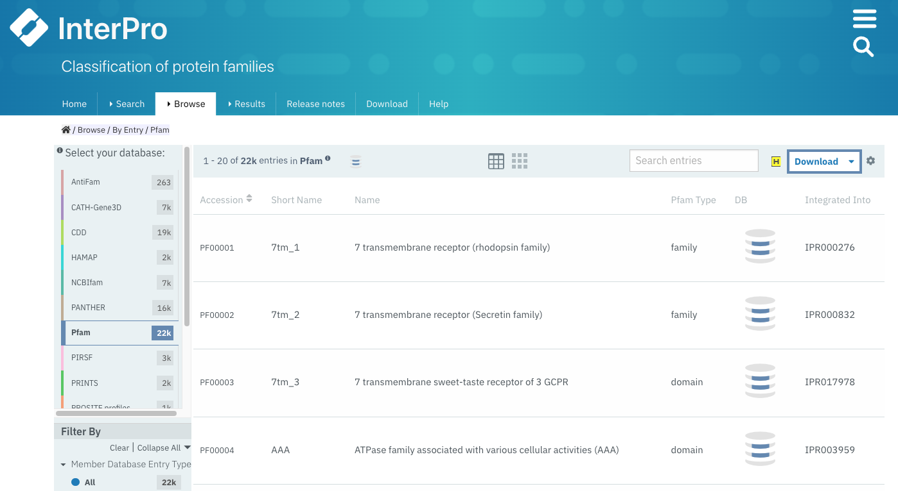

.. _searching-pfam:

**************
Searching Pfam
**************

There are multiple ways to look for information in Pfam by using the IntePro website.

.. _search:
Searching a specific Pfam entry 
===============================

Users can navigate to specific Pfam entry pages by entering the Pfam identifier or accession number or a keyword that form part of its name via three different **Search boxes**:

1. When selecting the **Browse + By member database** option, the search box is located in the header of the results table.

    Example of browsing the Pfam database. A paginated list of all available Pfam enties is displayed. A **Search box** appears on top of this list.

2. After selecting **Search + By text**, a larger text box is shown in the center of the page.

.. figure:: images/searchbytextpf.png
    :alt: Selecting **Search + By text**
    :width: 700
    :align: left

    Example of searching specific Pfam entry pages by entering the Pfam identifier or accession number or a keyword.

3. In the top right corner of any InterPro page, next to the magnifying glass. 

.. figure:: images/searchboxIP.png
    :alt: Search box available on the top right corner of any InterPro page.
    :width: 700
    :align: left

    On the InterPro website header, a search box appears when hovering the mouse next to the magnifying glass at the right; it can be used to search for Pfam information.

This text box allows you to go quickly to the relevant page in the InterPro site, by using:

.. list-table:: **SEARCH BY TEXT**
    :widths: 250 250
    :header-rows: 1

    * - Search
      - Find
    * - Pfam accession number
      - Pfam entry page
    * - Pfam identifier or name
      - Pfam entry page
    * - Set/clan identifier
      - Pfam Set/clan page
    * - UniProt accession
      - IntePro protein page, which includes Pfam matches (with coordinates)
    * - Gene names
      - IntePro protein page, which includes Pfam matches (with coordinates)
    * - PDB identifier
      - IntePro structure page, which includes a 3D visualisation of Pfam matches
    * - Proteomes
      - If it is a reference proteome, the InterPro proteome page will be displayed
    * - Keywords, free text
      - List of possible matches

Searching a protein sequence against Pfam
=========================================

Searching a protein sequence against the Pfam library of HMMs will enable you to find out the domain architecture of the protein, and thus what its potential function might be. If your protein is present in the version of UniProt used to make the current release of InterPro, we have already calculated its domain architecture. You can access this by entering the Uniprot sequence identifier in any of the Search boxes mentioned above (see :ref:`search`).

If your sequence is not in the InterPro database, you could perform a single-sequence or a batch search against the Pfam database on the InterPro website. This search uses the web based InterProScan tool, which allows you to scan up 100 sequences at a time with a maximum length of 40,000 amino acids. To run a any online search you can follow this steps:

1. Click the **Search + By Sequence** in the InterPro website menu. This opens the **Search InterPro** page. 

.. figure:: images/searchbyseq.png
    :alt: Selecting **Search + By Sequence** in the InterPro website menu
    :width: 700
    :align: left

    Selecting **Search + By Sequence** in the InterPro website menu.

2. Provide the FASTA formatted protein sequence(s) of interest by pasting them into the text box or by importing them from a file.

.. figure:: images/fasta.png
    :alt: Selecting **Search + By Sequence** in the InterPro website menu
    :width: 700
    :align: left

    Example of protein sequence in FASTA format in the **Enter your sequence box**.

3. Expand the **Advanced options**, click on **Unselect all** protein sequence applications and select Pfam

.. figure:: images/advanced_pf.png
    :alt: Selecting **Pfam** in the **Advanced options** drop-down
    :width: 700
    :align: left

    Select only **Pfam** to search your sequence(s) against this database.

4. Click the **Search** button

While the sequence search is running, you can continue to navigate through the website, other browser tabs or applications and will get a pop-up notification when the job has been completed (this requires the browser notifications to be enabled).

The results of the submitted job are accessible by selecting **Results + Your InterProScan Searches** in the InterPro website menu. 

.. figure:: images/results.png
    :alt: Selecting **Results + Your InterProScan Searches**
    :width: 700
    :align: left

    Select **Results + Your InterProScan Searches** in the InterPro website menu. 

All Pfam entries - and the InterPro entries where they are integrated - are displayed in the protein sequence viewer. The Pfam and InterPro entries are grouped by type (family, domain, repeat, site). The coloured bars indicate the location of entry matches on the protein sequence. Each matched InterPro entry is displayed on a separate line, with the Pfam entries integrated in it displayed below where pertinent. The Pfam entries that remain unintegrated in InterPro are displayed separately. The matches for Pfam-N are displayed below '**Other features**'. Pfam-N (N for network) provides additional Pfam matches identified by the Google Research team using deep learning approaches. You can read more about it `here <https://xfam.wordpress.com/tag/pfam-n/>`_.

.. figure:: images/exampleprotviewercolouredbymbdb.png
    :alt: Example of InterPro protein page with the protein viewer
    :width: 700
    :align: left

    Example of InterPro protein page. The integrated and unintegrated Pfam entries matching this protein sequence are shown in the protein viewer. The colour code of the protein viewer is customised as 'Colour By + Member Database' for all Pfam entries to be highlighted in blue.

On top of the sequence viewer, different icons allow to display the viewer on full screen and zoom in and out of the protein sequence. The **Options** button offers the posssibility to personalise the display by changing the colour code of the entries, the labels (accession number, short name and/or description can be displayed on the right-hand side of the viewer), collapsing the visualisation to show InterPro entries only or to display also the contributing entries from the member databases. The tooltip should be kept active to see a pop-up box with the accession number, description and amino acid coordinates of the match of an entry when hovering the mouse over it. Snapshots of the results can be taken in JPEG or PDF format.

*Local protein searches*
------------------------

Alternatively, if you have a very large number of protein searches to perform, or you do not wish to post your sequence across the web, it may be more convenient to `install and run InterProScan <https://interproscan-docs.readthedocs.io/en/latest/Introduction.html#to-install-and-run-interproscan>`_.

Finding proteins with a specific set of domain combinations (**Domain architectures**)
======================================================================================

Users can search protein sequences that contain specific Pfam entries in a particular arrangement by selecting **Search + By Domain architecture** in the InterPro website menu. Pfam entries that the proteins should or should not contain can be included or excluded from the domain architecture. The **Order of domain matters** option offers the possibility to arrange the domains in a particular order. The **Exact match** option fine tunes the search to find only proteins containing the selected domains (no extra domain in the proteins). Domains can be selected by entering a domain name or Pfam accession.

.. figure:: images/domarch.png
    :alt: Selecting **Search + By Domain architecture** 
    :width: 700
    :align: left

    Select **Search + By Domain architecture** in the IntePro menu, enter the desired Pfam entries and select/unselect the relevant options.
