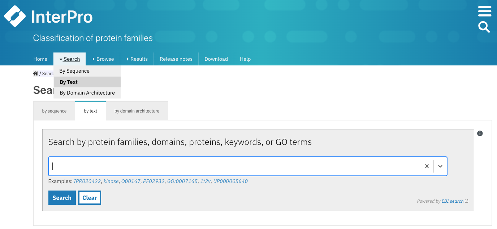
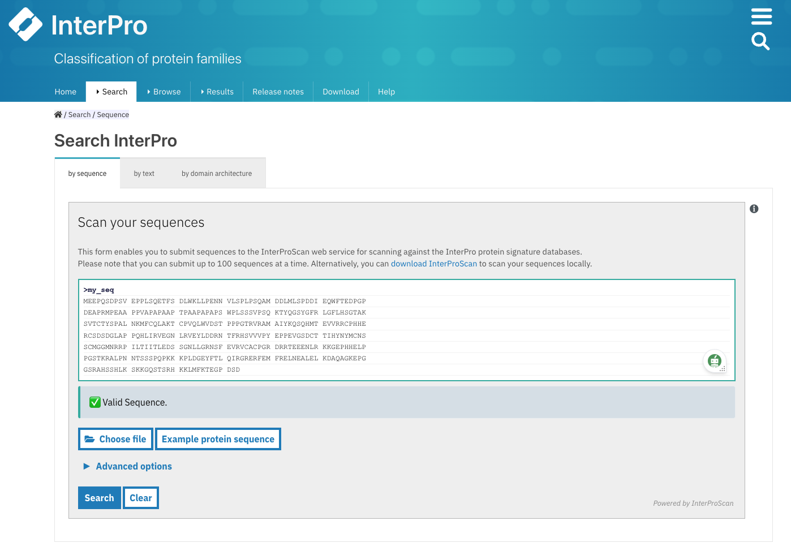

**************
Searching Pfam
**************

There are multiple ways to look for information in Pfam by using the `IntePro website <https://www.ebi.ac.uk/interpro/>`_.

.. _search-boxes:

Searching a specific Pfam entry 
===============================

Users can navigate to specific Pfam entry page by entering the Pfam identifier or accession number or a keyword that form part of its name 
via three different **Search boxes**:

1. When selecting the `Browse + By member database <https://www.ebi.ac.uk/interpro/entry/pfam/#table>`_ option, 
the search box is located in the header of the results table.
The results can be filtered by **Member Database Entry Type** and **InterPro state**, and can be ordered by accession in ascending or descending order by clicking on the arrow at the right side of the column name **Accession**.

.. figure:: images/browsebymbdbpfam.png
  :alt: Selecting the 'Browse + By member database' option and Pfam.
  :width: 700
  :align: left

  Example of browsing the Pfam database. A paginated list of all available Pfam entries is displayed. 
  A **Search box** is available in the table header, next to the Download button.

2. After selecting `Search + By text <https://www.ebi.ac.uk/interpro/search/text/>`_, a text box is displayed.

  Example of searching specific Pfam entry pages by entering the Pfam identifier or accession number or a keyword.

3. In the top right corner of any InterPro page, next to the magnifying glass. 

.. figure:: images/searchboxIP.png
  :alt: Search box available on the top right corner of any InterPro page.
  :width: 700
  :align: left

  On the InterPro website header, a search box appears when hovering the mouse next to the magnifying glass on the right; 
  it can be used to search for Pfam information.

This text box allows you to go quickly to the relevant page in the InterPro site, by using:

.. list-table:: 
  :widths: 250 250
  :header-rows: 1

  * - Search
    - Find
  * - Pfam accession number
    - Pfam entry page
  * - Pfam identifier or name
    - Pfam entry page
  * - Clan identifier
    - Pfam Clan page
  * - UniProt accession
    - Protein page, which includes Pfam matches (with coordinates)
  * - Gene names
    - Protein page, which includes Pfam matches (with coordinates)
  * - PDB identifier
    - Structure page, which includes a 3D view the PDB structure and Pfam matches for each PDB chain
  * - Proteomes
    - If it is a reference proteome, the proteome page will be displayed
  * - Keywords, free text
    - List of possible matches

Searching a protein sequence against Pfam
=========================================

Searching a protein sequence against the Pfam library of HMMs will enable you to find out the domain architecture of the protein, 
and thus what its potential function might be. If your protein is present in the UniProt version used to make the current 
release of InterPro, we have already calculated its domain architecture. You can access this by entering the Uniprot 
accession in any of the Search boxes mentioned above (see :ref:`Searching a specific Pfam entry <search-boxes>`).

.. _search-by-sequence:

Using the InterPro online sequence search
-----------------------------------------

If your sequence is not in the InterPro database, you could perform a single or multiple sequence search against the Pfam database 
on the InterPro website. This search uses the InterProScan tool, which allows you to search up to 100 nucleotide (DNA/RNA) or 
protein sequences at a time with a maximum length of 40,000 characters. To run any online search you can follow these steps:

1. Click the **Search + By Sequence** in the InterPro website menu. This opens the `InterPro sequence search page <https://www.ebi.ac.uk/interpro/search/sequence/>`_. 

.. figure:: images/searchbyseq.png
  :alt: Selecting Search + By Sequence in the InterPro website menu
  :width: 700
  :align: left

  Selecting **Search + By Sequence** in the InterPro website menu.

2. Provide the FASTA formatted nucleotide or protein sequence(s) of interest by pasting them into the text box or import them by uploading a file.

  Example of protein sequence in FASTA format in the text box.

3. Expand the **Advanced options**, select the appropriate sequence type (protein -amino acids-, or RNA/DNA -nucleotides-), click on 
**Unselect all** protein sequence applications and select **Pfam**.

  Select only **Pfam** to search your sequence(s) against this database.

4. Click on the **Search** button.

While the sequence search is running, you can continue to navigate through the website, other browser tabs or applications and will 
get a pop-up notification when the job has been completed (this requires the browser notifications to be enabled).

The results of the submitted job are accessible by selecting `Results + Your InterProScan Searches <https://www.ebi.ac.uk/interpro/result/InterProScan/#table>`_ 
in the InterPro website menu. This page displays the sequence searches that have been
performed in the last seven days, with the most recent one being displayed at the top. The *Status* 
column gives an indication of whether or not the search has completed (green tick symbol / searching), if the 
search has been saved locally (the results will still be available even after the seven days limit set up on 
InterPro servers), or if the results have been imported (file symbol). Searches can be deleted or saved locally 
by clicking on the bin or file icon in the *Action* column, respectively.

.. figure:: images/results_list_jobs.png
  :alt: Selecting Results + Your InterProScan Searches
  :width: 700
  :align: left

  Select **Results + Your InterProScan Searches** in the InterPro website menu. 

Clicking on the job ID or on the text in the *Results* column opens a page summarising the search, including the 
sequence type, number of sequences, status and expiry date (see figure below).
When a search has been run using a previous version of InterProScan, it can be re-run using the latest 
version of the software by clicking on the **Resubmit All** button. If the search has been run in the last seven 
days, the results can be saved in the browser to be able to access them once the seven days limit has been reached 
by clicking on the **Save results in Browser** button.
The results can be downloaded by clicking on the **Download** button. If the search has been run in the last seven days
the results can be downloaded in TSV, JSON, XML and GFF formats, thereafter, if the search has been saved locally, 
the results are only available in JSON format.

All the submitted sequences are listed in a table. Clicking on the name in the **Sequence** column allows to 
access the results summarised in a sequence viewer (see the :ref:`sequence viewer <protein-viewer>` section below).

  List of sequences for a search, select one sequence to view the Pfam matches.

.. _protein-viewer:
Interpreting the sequence viewer
^^^^^^^^^^^^^^^^^^^^^^^^^^^^^^^^

All Pfam entries are displayed in the sequence viewer. They are grouped by entry types (family, domain, repeat, site). 
The coloured bars indicate the location of entry matches on the protein sequence. 
The first line of the Domains category contains a summary of the domains found in the protein.
On the right-hand side, the Pfam accession 
and short name and, when the Pfam is integrated, the InterPro entry information is displayed above the Pfam information. The Pfam 
entries that remain unintegrated in InterPro entries are displayed separately in the *Unintegrated* category.

On top of the sequence viewer, different icons allow to display the viewer on full screen and zoom in and out of the protein sequence. 
The **Options** button offers the possibility to personalise the display by changing the colour code of the entries, the labels 
(accession number, short name and/or description can be displayed on the right-hand side of the viewer). The tooltip should be kept active 
to see a pop-up box with the accession number, description and amino acid coordinates of the match of a Pfam and the InterPro entry accession 
when hovering the mouse over it. Results can be downloaded in multiple formats by clicking 
on the **Download** button.

.. protein used: https://www.ebi.ac.uk/interpro/protein/reviewed/A0LEL7/

  Results of a protein sequence search. The integrated and unintegrated Pfam entries matching this  sequence are shown in the 
  sequence viewer. The colour of the matches is customised as **Colour By + Member Database** for all Pfam entries to be 
  highlighted in blue.

Local sequence search
--------------------

Alternatively, if you have a very large number of protein searches to perform, or you do not wish to share your sequence, 
it may be more convenient to 
`install and run InterProScan <https://interproscan-docs.readthedocs.io/en/latest/Introduction.html#to-install-and-run-interproscan>`_.

Finding proteins with a specific set of domain combinations (**Domain architectures**)
======================================================================================

Users can search proteins that contain specific Pfam entries in a particular arrangement by selecting 
`Search + By Domain architecture <https://www.ebi.ac.uk/interpro/search/ida/>`_ 
in the InterPro website menu. Pfam entries that the proteins should or should not contain can be 
included or excluded from the domain architecture. 
The **Order of domain matters** option offers the possibility to arrange the domains in a particular order. The **Exact match** option fine tunes 
the search to find only proteins containing the selected domains (no extra domain in the proteins). Domains can be selected by entering a domain 
name, Pfam accession or InterPro accession.

.. figure:: images/domarch.png
  :alt: Selecting Search + By Domain architecture 
  :width: 700
  :align: left

  Select **Search + By Domain architecture** in the InterPro menu, enter the desired Pfam entries and select/unselect the relevant options.
