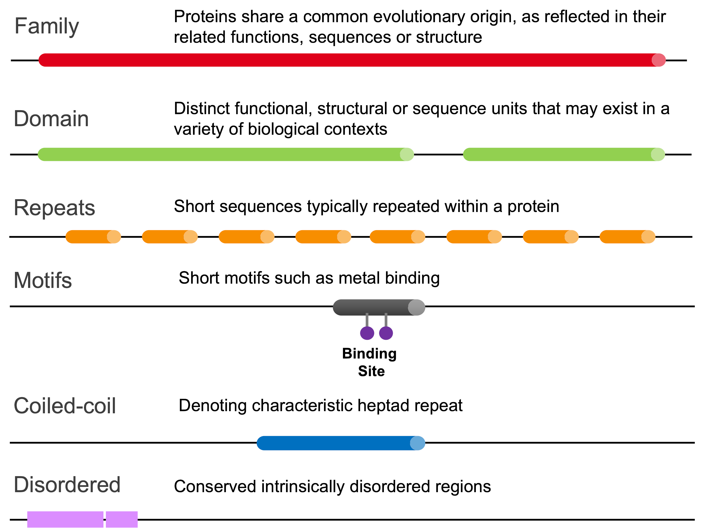

*******
Summary
*******

Proteins are generally comprised of one or more functional regions, commonly termed domains. The presence of different domains in varying combinations 
in different proteins gives rise to the diverse repertoire of proteins found in nature. Identifying the domains present in a protein can provide 
insights into the function of that protein.

The Pfam database is a large collection of protein domain families. Each family is represented by multiple sequence alignments and a profile hidden 
Markov model (HMM).

Each Pfam family, sometimes referred to as a Pfam-A entry, consists of a curated seed alignment containing a small set of representative members of the 
family, profile HMMs built from the seed alignment, and an automatically generated full alignment, which contains all detectable protein sequences 
belonging to the family, as defined by profile HMM searches of primary sequence databases.

Pfam entries are classified in one of six types:

    Types of Pfam entries.

Related Pfam entries are grouped together into clans; the relationship may be defined by similarity of sequence, structure or profile HMM. 
